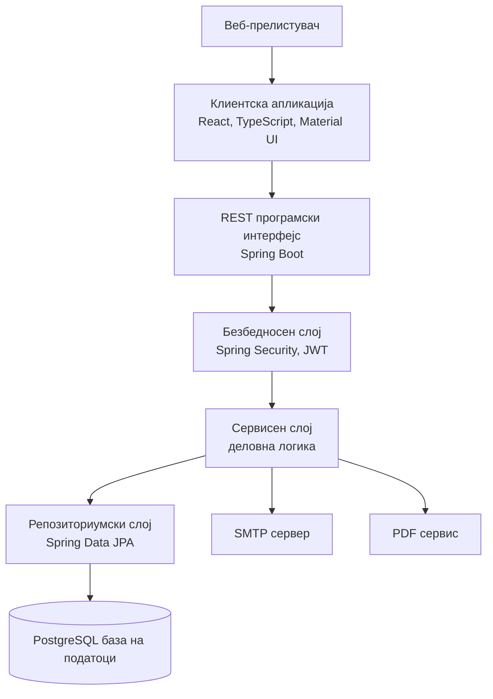
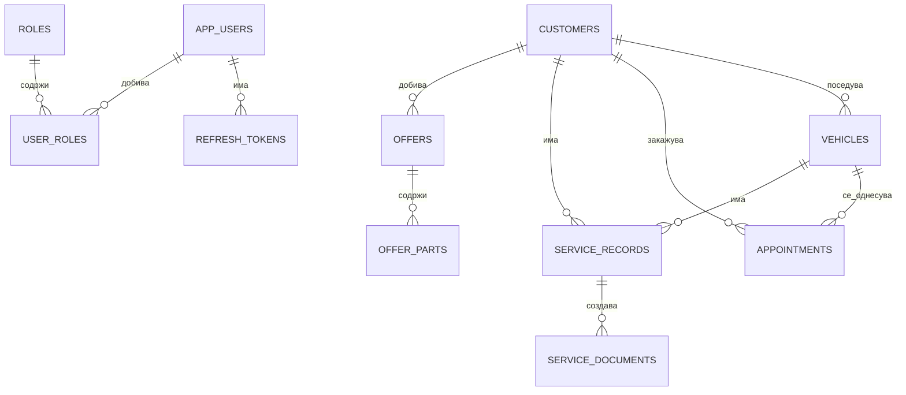
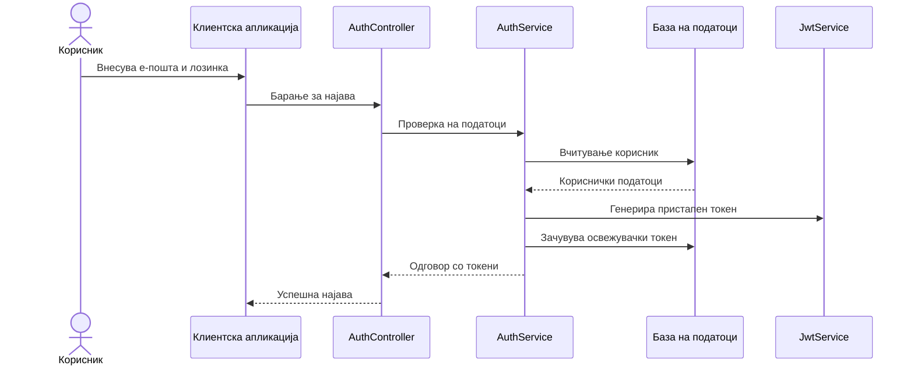
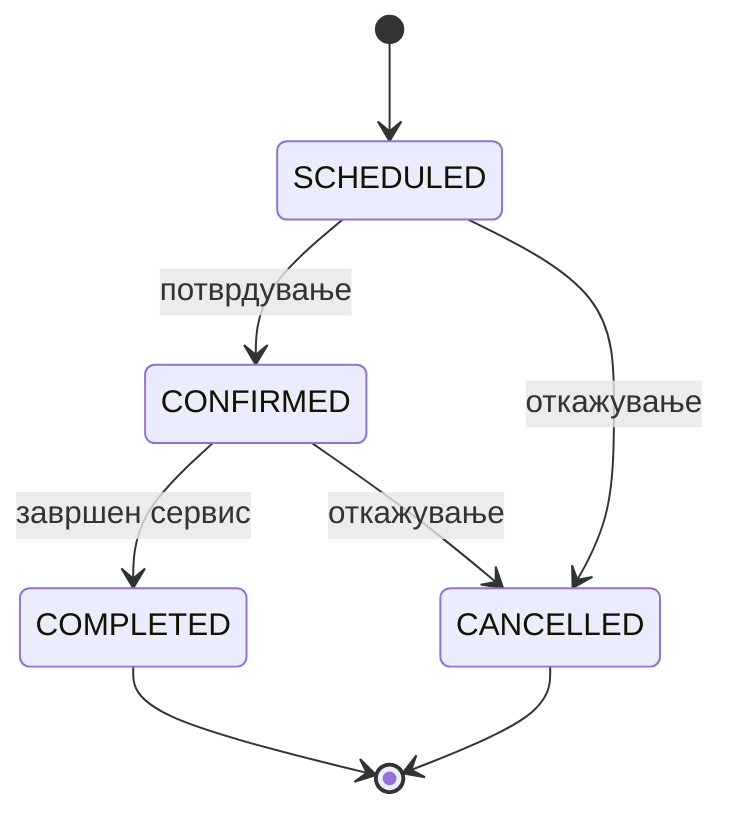
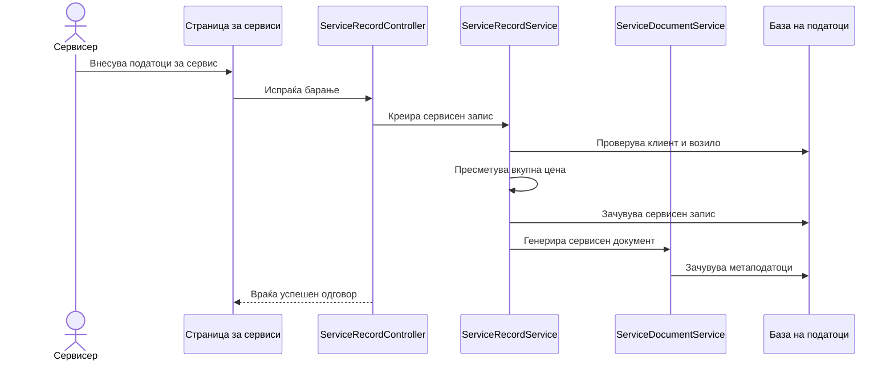
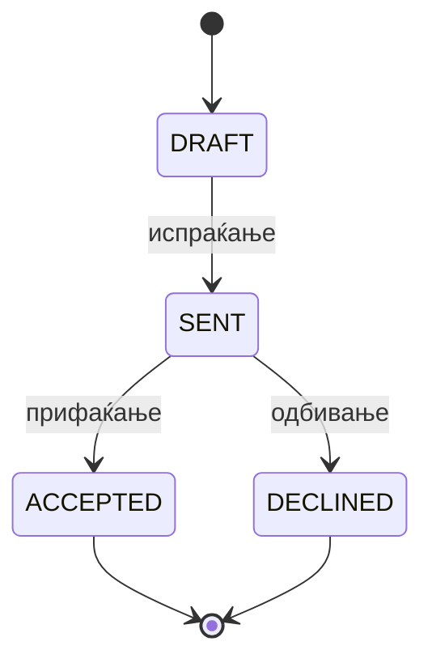

# **Спецификација за дизајн на софтвер**

за

**Систем за управување со автомобилски сервиси и сервисна историја**

Верзија: 1.0

Автор: Стојан Делеников

Датум: 17.06.2026

---

## **Содржина**

| Поглавје | Наслов |
|---:|---|
| 1 | Вовед |
| 2 | Преглед на системот |
| 3 | Дизајнерски размислувања |
| 3.1 | Претпоставки и зависности |
| 3.2 | Општи ограничувања |
| 3.3 | Цели и насоки |
| 3.4 | Методи на развој |
| 4 | Архитектонски стратегии |
| 5 | Архитектура на системот |
| 6 | Архитектура на потсистемите |
| 7 | Политики и тактики |
| 8 | Детален дизајн на системот |
| 9 | Детален дизајн на потсистемите |
| 10 | Поимник |
| 11 | Библиографија |

---

## **1. Вовед**

Овој документ претставува спецификација за дизајн на софтвер за системот за управување со автомобилски сервиси и сервисна историја. Документот го опишува техничкото решение, архитектурата, потсистемите, главните компоненти, начинот на комуникација, обработката на податоци, безбедносните механизми и политиките што се користат при имплементација на системот.

Целта на документот е да обезбеди јасен и формален опис на начинот на кој системот треба да биде изграден, така што развојот, тестирањето, одржувањето и идното проширување да може да се изведуваат врз стабилна техничка основа. Документот е наменет за развојниот тим, тестерите, проектниот ментор, професорите и другите засегнати страни кои треба да ја разберат внатрешната организација на системот.

Опфатот на документот ги вклучува клиентската апликација, серверската апликација, базата на податоци, надворешните интеграции, безбедносниот модел и главните деловни модули. Системот е идентификуван како **Систем за управување со автомобилски сервиси и сервисна историја**, верзија 1.0.

Документот е подготвен врз основа на следните проектни и референтни документи:

| Референтен документ | Опис |
|---|---|
| `docs/srs_mk.md` | Спецификација на софтверски барања за системот. |
| `docs/mini_specification_mk.md` | Почетен опис на системот, корисниците и функционалностите. |
| `docs/business-rules.md` | Правила за автентикација со пристапни и освежувачки токени. |
| `docs/spec-implementation-check.md` | Проверка на имплементираните функционалности и преостанати технички празнини. |
| IEEE 1016 | Референтен стандард за опис на софтверски дизајн. |
| IEEE 830 / IEEE 29148 | Референтни стандарди за спецификација и инженерство на софтверски барања. |

Во документот се користат стандардни технички термини од областа на софтверското инженерство. Кратенките и поимите што се користат низ документот се објаснети во поглавјето „Поимник“.

---

## **2. Преглед на системот**

Системот за управување со автомобилски сервиси и сервисна историја претставува веб-базирана апликација наменета за дигитализација на секојдневното работење на автомобилски сервис. Основната цел на системот е да ја замени хартиената и неструктурираната електронска евиденција со централизирано, безбедно и организирано управување со податоци за клиенти, возила, термини, сервисни интервенции, понуди и сервисни документи.

Системот е организиран како клиент-сервер апликација. Клиентската страна е веб-апликација што се извршува во прелистувач, а серверската страна обезбедува REST програмски интерфејс и ја содржи деловната логика. Податоците се складираат во PostgreSQL база на податоци, а структурата на базата се управува со Flyway миграции.

Главните функционалности на системот се:

- најава, одјава и промена на лозинка;
- управување со системски корисници и улоги;
- управување со клиенти;
- управување со возила;
- пребарување клиенти и возила;
- закажување, преглед и откажување термини;
- приказ на слободни термини;
- испраќање електронски потврди и потсетници;
- евиденција на сервисна историја;
- пресметка на трошоци за делови и работна рака;
- креирање и испраќање понуди;
- автоматско генерирање сервисни документи;
- извоз на понуди и документи во PDF формат;
- препознавање лојални клиенти и пресметка на попуст.

Главните корисници на системот се администраторот, сервисерот и клиентот. Администраторот управува со корисничките сметки и системските податоци. Сервисерот ги користи оперативните функционалности за клиенти, возила, термини, сервиси, понуди и документи. Клиентот е надворешен актер кој може јавно да закаже термин, да добие електронски известувања и да откаже термин преку безбеден линк.

Општата организација на системот е прикажана на следниот дијаграм:



Основниот пристап кон дизајнот е слоевита и модуларна организација. Секој модул има јасна одговорност, а комуникацијата меѓу модулите се изведува преку контролирани сервисни методи и DTO објекти.

---

## **3. Дизајнерски размислувања**

Ова поглавје ги опишува претпоставките, ограничувањата, целите и развојните методи што влијаат врз изборот на дизајнот.

### **3.1 Претпоставки и зависности**

Системот се дизајнира со следните претпоставки:

| Претпоставка | Влијание врз дизајнот |
|---|---|
| Системот се користи во рамки на еден автомобилски сервис во првата верзија. | Не се воведува сложена архитектура за повеќе организации или повеќе сервисни центри. |
| Корисниците пристапуваат преку современ веб-прелистувач. | Клиентската апликација се реализира како веб-апликација без потреба од локална инсталација. |
| Серверската околина обезбедува Java платформа и пристап до PostgreSQL база. | Серверската страна се реализира со Spring Boot и Spring Data JPA. |
| SMTP серверот е достапен за испраќање пораки. | Модулите за термини, понуди и документи можат да испраќаат електронски известувања. |
| Клиентите немаат корисничка сметка. | Јавните функционалности се ограничени на закажување и откажување термин. |
| Сервисерите имаат основни дигитални вештини. | Интерфејсот треба да биде јасен, но може да користи табели, форми и календарски приказ. |

Главните технички зависности се:

- React, TypeScript, Vite и Material UI за клиентската апликација;
- React Router за навигација;
- TanStack Query и Axios за комуникација со серверот;
- Java, Spring Boot, Spring Security и Spring Data JPA за серверската апликација;
- PostgreSQL за трајно складирање податоци;
- Flyway за миграции на база;
- Spring Mail и SMTP за електронска пошта;
- JWT и BCrypt за автентикација и безбедно чување лозинки;
- JUnit 5, Mockito, React Testing Library и Playwright за тестирање;
- Docker и Kubernetes како предвидени технологии за извршување и распоредување.

### **3.2 Општи ограничувања**

Дизајнот е ограничен од функционалните и нефункционалните барања дефинирани во SRS документот. Системот мора да обезбеди контрола на пристап, безбедно чување лозинки, обработка на податоци преку REST интерфејс, поддршка за македонски јазик, календарски приказ на термини и структурирано складирање на податоците.

Следните ограничувања имаат значајно влијание врз дизајнот:

| Ограничување | Објаснување |
|---|---|
| Клиент-сервер архитектура | Клиентската страна не пристапува директно до базата, туку комуницира преку REST API. |
| Слоевита организација | Контролерите не содржат деловна логика; деловните правила се во сервисниот слој. |
| Релациска база | Податоците се организираат во табели со странски клучеви и индекси. |
| Безбедносни барања | Сите заштитени операции бараат валиден JWT токен. |
| Јавни функционалности | Само закажувањето и откажувањето термин се достапни без најава. |
| Финансиски податоци | Цените се чуваат со децимална прецизност и се пресметуваат на серверска страна. |
| Временска зона | Термините се обработуваат според временската зона Europe/Skopje. |
| Верзионирање на API | Како целно ограничување, API патеките треба да се верзионираат со `/api/v1/`. Во тековната имплементација дел од патеките се под `/api/`, што е забележано како техничко подобрување. |

Системот не обработува електронски плаќања, не складира податоци од платежни картички и не се поврзува со платежни процесори. Плаќањето се изведува физички во сервисот.

### **3.3 Цели и насоки**

Дизајнот се води од следните цели:

| Цел | Причина |
|---|---|
| Едноставна и разбирлива структура | Системот е факултетски проект, но треба да биде доволно реалистичен за одржување и проширување. |
| Јасна поделба на одговорности | Поделбата на контролери, сервиси, репозиториуми и база ја намалува сложеноста. |
| Безбедност на податоците | Системот обработува лични податоци за клиенти и мора да спречи неовластен пристап. |
| Проширливост | Во иднина може да се додадат SMS известувања, фактурирање, повеќе сервиси и мобилна апликација. |
| Употребливост | Сервисерите треба брзо да пристапуваат до секојдневните операции. |
| Трага на промени | Ревизиските полиња и настани овозможуваат следење на важни активности. |
| Тестливост | Модуларноста овозможува единични, интеграциски и кориснички тестови. |

Како главен принцип се применува едноставност на дизајнот. Наместо непотребно сложени шаблони, се избираат јасни компоненти што одговараат на реалните потреби на системот.

### **3.4 Методи на развој**

При развојот на системот се применува итеративен пристап. Функционалностите се развиваат по модули, при што секој модул опфаќа серверска имплементација, база на податоци, REST интерфејс, клиентска страница, валидација и тестови.

Развојниот пристап ги комбинира следните методи:

- **објектно-ориентиран дизајн**, бидејќи серверската апликација е организирана околу класи, ентитети, сервиси и репозиториуми;
- **итеративен развој**, бидејќи функционалностите се прошируваат преку повеќе миграции и тестови;
- **слоевит архитектурен пристап**, бидејќи системот е поделен на презентациски, апликациски и податочен слој;
- **тестирање водено од ризик**, бидејќи критичните функции како автентикација, термини, пресметки и документи се покриени со тестови.

---

## **4. Архитектонски стратегии**

Архитектонските стратегии ги претставуваат клучните одлуки што ја одредуваат целокупната структура на системот.

### **4.1 Избор на клиентска технологија**

Клиентската апликација се реализира со React и TypeScript. React овозможува компоненти што може повторно да се користат, а TypeScript обезбедува статичка проверка на типовите. Material UI се користи за унифициран визуелен изглед, форми, табели, дијалози и навигациски елементи.

Разгледана алтернатива е класична серверски рендерирана апликација, но таа би понудила помала интерактивност за календарски приказ, динамички форми и автоматско освежување на податоци.

### **4.2 Избор на серверска технологија**

Серверската апликација се реализира со Spring Boot. Оваа платформа обезбедува стабилна основа за REST интерфејси, безбедност, работа со база, валидација, конфигурација и тестирање. Spring Security се користи за автентикација и авторизација, а Spring Data JPA за комуникација со базата.

Овој избор е соодветен бидејќи проектот бара модуларна архитектура, безбедносен модел и стабилно управување со податоци.

### **4.3 Избор на база на податоци**

PostgreSQL е избрана како релациска база на податоци поради поддршка за трансакции, референтен интегритет, индекси и стабилност. Податоците во системот имаат јасни врски: клиент има возила, возило има сервисна историја, термин е поврзан со клиент и возило, понуда може да содржи повеќе делови.

### **4.4 Управување со автентикација**

Системот користи JWT пристапни токени и освежувачки токени. Пристапниот токен има краток рок на важност од 15 минути и се испраќа во HTTP заглавието `Authorization`. Освежувачкиот токен има рок на важност од 30 дена и служи за добивање нов пристапен токен без повторна најава.

Овој пристап е избран бидејќи овозможува безсостојбена серверска автентикација и подобра контрола на сесиите преку поништување на освежувачките токени при одјава или промена на лозинка.

### **4.5 Управување со грешки**

Грешките се обработуваат централизирано на серверската страна. Валидациските грешки, неуспешната најава и деловните исклучоци се претвораат во структурирани HTTP одговори. Клиентската апликација ги прикажува грешките преку пораки во интерфејсот.

### **4.6 Управување со податоци и миграции**

Flyway се користи за контрола на промените во структурата на базата. Секоја промена во табелите, индексите или колоните се запишува како миграциска датотека. Ова овозможува повторливо поставување на системот во развојна, тестна и продукциска околина.

### **4.7 Идно проширување**

Архитектурата дозволува идно додавање SMS известувања, интеграција со фактурирање, складирање документи во надворешен објектен простор, поддршка за повеќе сервисни центри и напредни аналитички извештаи. Овие проширувања може да се додадат преку нови потсистеми без целосна промена на постојната архитектура.

---

## **5. Архитектура на системот**

Системот е поделен на четири главни архитектурни целини:

| Целина | Опис |
|---|---|
| Клиентска апликација | Веб-интерфејс за корисниците, развиен со React и TypeScript. |
| Серверска апликација | REST API, деловна логика, безбедност и интеграции, развиени со Spring Boot. |
| База на податоци | PostgreSQL база со табели, индекси, странски клучеви и миграции. |
| Надворешни сервиси | SMTP сервер за електронска пошта и PDF сервис за документи. |

Серверската апликација следи слоевита организација:

```text
Контролер
Сервис и мапирање на податоци
Репозиториум
База на податоци
```

Контролерите ги примаат HTTP барањата и ги проследуваат кон сервисниот слој. Сервисите ги применуваат деловните правила, вршат пресметки и координираат повеќе репозиториуми. Репозиториумите ја извршуваат комуникацијата со PostgreSQL базата. Ентитетите ја претставуваат трајната структура на податоците, а DTO објектите се користат за пренос на податоци кон клиентот.

Главните комуникациски врски се:

- клиентската апликација комуницира со серверот преку HTTP и JSON;
- серверот комуницира со базата преку JPA;
- серверот комуницира со SMTP сервер преку Spring Mail;
- серверот генерира PDF документи преку посебен сервис;
- клиентската апликација автоматски го освежува пристапниот токен кога тој истекува.

---

## **6. Архитектура на потсистемите**

### **6.1 Потсистем за автентикација и безбедност**

Овој потсистем управува со најава, освежување токени, одјава, промена на лозинка и проверка на кориснички улоги. Главни компоненти се `AuthController`, `AuthService`, `JwtService`, `JwtAuthenticationFilter`, `SecurityConfig` и `CarcareUserDetailsService`.

### **6.2 Потсистем за корисници и улоги**

Потсистемот обезбедува креирање, измена и оневозможување системски корисници. Администраторот може да управува со кориснички сметки, додека обичните вработени немаат пристап до административните операции.

### **6.3 Потсистем за клиенти**

Потсистемот управува со личните податоци за клиентите, пребарувањето по име и презиме, мекото бришење и приказот на поврзани возила и сервисна историја.

### **6.4 Потсистем за возила**

Овој потсистем овозможува внесување и ажурирање возила, поврзување возило со клиент и пребарување според VIN број, регистарска таблица или сопственик.

### **6.5 Потсистем за термини**

Потсистемот за термини обезбедува приказ на слободни термини, внатрешно и јавно закажување, спречување преклопување, откажување преку безбеден линк и испраќање потсетници.

### **6.6 Потсистем за сервисна историја**

Овој потсистем чува записи за извршени сервиси, тип на сервис, датум, километража, заменети делови, цена на делови, цена на работна рака и вкупна цена.

### **6.7 Потсистем за понуди**

Потсистемот за понуди овозможува креирање понуди со детална финансиска структура, делови, работна рака, меѓузбир, попуст и конечна цена. Понудите може да се испраќаат по електронска пошта и да се извезуваат како PDF.

### **6.8 Потсистем за сервисни документи**

Потсистемот автоматски генерира сервисен документ по завршен сервисен запис. Документот може да се испрати до клиентот и да се извезе во PDF формат.

### **6.9 Потсистем за лојалност**

Потсистемот пресметува дали клиентот е лојален според бројот на завршени сервиси. Во тековниот дизајн клиент со најмалку пет завршени сервисни записи добива попуст од 10% на идни понуди.

### **6.10 Потсистем за ревизија**

Потсистемот за ревизија бележи важни активности, како успешна најава, промена на чувствителни податоци и други значајни системски настани. Табелата за ревизиски настани содржи актер, акција, тип на ентитет, идентификатор и детали.

---

## **7. Политики и тактики**

### **7.1 Избор на алатки**

| Област | Избрани алатки |
|---|---|
| Клиентска апликација | React, TypeScript, Vite, Material UI |
| Серверска апликација | Java, Spring Boot, Spring Security, Spring Data JPA |
| База на податоци | PostgreSQL, Flyway |
| Автентикација | JWT, BCrypt |
| Електронска пошта | Spring Mail, SMTP |
| Тестирање | JUnit 5, Mockito, React Testing Library, Playwright |
| Распоредување | Docker, Kubernetes |

### **7.2 Кодирачки стандарди**

Кодот треба да биде организиран по модули. Деловната логика се поставува во сервисниот слој, контролерите треба да бидат тенки, а репозиториумите да се користат само за пристап до податоци. Ентитетите не треба директно да се изложуваат преку REST API. За комуникација со клиентот се користат DTO објекти.

### **7.3 Конвенции за именување**

Класите се именуваат според нивната улога, на пример `CustomerService`, `VehicleController`, `AppointmentRepository` и `OfferResponse`. Табелите во базата се именуваат со мали букви и долна црта, на пример `service_records`, `refresh_tokens` и `audit_events`.

### **7.4 Планови за тестирање**

Тестирањето опфаќа единични тестови за сервисниот слој, интеграциски тестови со PostgreSQL Testcontainers и кориснички тестови со Playwright. Особено внимание се посветува на автентикацијата, термините, пресметките на цени, лојалноста и генерирањето документи.

### **7.5 Планови за одржување**

Одржувањето треба да се изведува преку контролирани промени во кодот, нови Flyway миграции за промени во базата, проширување на тестовите и ажурирање на документацијата. Продукциските тајни не треба да се чуваат во изворниот код.

### **7.6 Процес на градење**

Серверската апликација се гради со Maven, а клиентската апликација со Vite. Пред испорака треба да се извршат серверските и клиентските тестови, како и проверка на изградба на клиентската апликација.

---

## **8. Детален дизајн на системот**

Ова поглавје го опишува дизајнот на системските компоненти на ниво што е доволно за преглед на архитектурата, без непотребно копирање на изворниот код. За секоја компонента се користи ист образец: класификација, дефиниција, одговорности, ограничувања, состав, интеракции, ресурси, обработка и интерфејс/извоз. Деталите што природно припаѓаат во кодот се референцирани преку патеки до класите, DTO објектите, репозиториумите, страниците и миграциите.

Описот е усогласен со барањата FR-1 до FR-44 и NFR-1 до NFR-20 од `docs/srs_mk.md`, со техничките правила од `docs/business-rules.md` и со проверката на имплементација во `docs/spec-implementation-check.md`. Кога постои разлика меѓу целниот дизајн и тековната имплементација, тоа е означено како ограничување или технички долг.

### **8.1 Контролерски слој**

| Атрибут | Опис |
|---|---|
| Класификација | Серверски REST контролери во Spring Boot. |
| Дефиниција | Компоненти што го претставуваат HTTP интерфејсот на системот и ги преведуваат барањата од клиентската апликација во повици кон сервисниот слој. |
| Одговорности | Прием на JSON барања, активирање Bean Validation, читање параметри од патека и query string, повикување сервисни методи и враќање DTO одговори или бинарни PDF одговори. |
| Ограничувања | Контролерите не смеат да содржат деловна логика, пресметки на цени, правила за лојалност, правила за термини или директен пристап до репозиториуми. Сите заштитени крајни точки зависат од Spring Security контекстот. Целниот дизајн бара `/api/v1/`, додека тековната имплементација користи `/api/`, што е забележан технички долг. |
| Состав | `AuthController`, `AdminUserController`, `CustomerController`, `VehicleController`, `AppointmentController`, `ServiceRecordController`, `OfferController`, `ServiceDocumentController` и `DashboardController`. |
| Употреби/Интеракции | Клиентската апликација ги користи контролерите преку Axios модулите во `frontend/src/api/modules.ts`. Контролерите користат сервиси преку constructor injection и не ја менуваат базата директно. |
| Ресурси | HTTP барања и одговори, JSON DTO објекти, `Authorization` заглавие, безбедносен контекст, MIME тип `application/pdf` за извоз. |
| Обработка | Контролерот прима барање, Spring го мапира телото во request DTO, валидацијата ги запира невалидните барања, сервисот ја извршува операцијата, а контролерот враќа response DTO, празен одговор или бинарна содржина. Сложеностa е O(1) на ниво на контролер; реалната сложеност е во сервисите и базата. |
| Интерфејс/Извоз | REST крајни точки: `/api/auth/*`, `/api/admin/users`, `/api/customers`, `/api/vehicles`, `/api/appointments`, `/api/service-records`, `/api/offers`, `/api/documents`, `/api/dashboard/summary`. Прецизните декларации се во `src/main/java/com/delenicode/carcare/**/**Controller.java`. |

### **8.2 Сервисен слој**

| Атрибут | Опис |
|---|---|
| Класификација | Апликациски и доменски сервиси. |
| Дефиниција | Компоненти што ги имплементираат деловните случаи од SRS: автентикација, CRUD операции, пребарување, закажување, пресметки, лојалност, известувања и документи. |
| Одговорности | Проверка на предуслови, примена на деловни правила, пресметка на вкупни износи и попусти, управување со трансакции, креирање DTO одговори, координација со репозиториуми, email/PDF сервиси и ревизиски записи. |
| Ограничувања | Сервисите не зависат од React, HTML структурата на страниците или детали на HTTP протоколот. Сервисните методи што менуваат состојба се трансакциски. Идентификаторите во тековниот код се `Long`, додека целното правило бара UUID, па идната миграција треба да го адресира тоа без промена на деловните договори. |
| Состав | `AuthService`, `CustomerService`, `VehicleService`, `AppointmentService`, `ServiceRecordService`, `OfferService`, `ServiceDocumentService`, `CustomerLoyaltyService`, `DashboardService`, `EmailService`, `PdfService` и `AuditService`. |
| Употреби/Интеракции | Контролерите ги повикуваат сервисите. Сервисите повикуваат репозиториуми, `JwtService`, `PasswordEncoder`, `EmailService`, `PdfService` и други доменски сервиси. `ServiceRecordService` иницира документ, а `OfferService` користи лојалност за попуст. |
| Ресурси | PostgreSQL трансакции, SMTP сервер, криптографски генератори, системско време, конфигурација за URL на клиентската апликација, меморија за генерирање PDF бајти. |
| Обработка | Сервисите ги вчитуваат потребните ентитети, ги проверуваат инваријантите, ја менуваат состојбата, зачувуваат преку репозиториум и враќаат DTO. Операциите со листи се O(n) над резултатот од базата; проверките за конфликт кај термини зависат од бројот на термини во избраниот интервал и треба да се поддржат со индекси. |
| Интерфејс/Извоз | Јавни Java методи повикани од контролерите, на пример `login`, `refresh`, `create`, `findAll`, `availableSlots`, `cancelByToken`, `send`, `exportPdf`. Декларациите се во `src/main/java/com/delenicode/carcare/**/**Service.java`. |

### **8.3 Репозиториумски слој**

| Атрибут | Опис |
|---|---|
| Класификација | Spring Data JPA репозиториуми. |
| Дефиниција | Компоненти што го изолираат пристапот до PostgreSQL од останатите слоеви. |
| Одговорности | Читање, зачувување, пребарување, проверка на постоење и бришење податоци преку JPA. |
| Ограничувања | Репозиториумите не содржат деловни правила и не испраќаат email, не генерираат документи и не вршат авторизација. За листи, целниот дизајн бара пагинација; тековната имплементација враќа листи и тоа останува технички долг. |
| Состав | Репозиториуми за корисници, клиенти, возила, термини, сервиси, понуди, документи и ревизија. |
| Употреби/Интеракции | Сервисниот слој ги повикува репозиториумите. Hibernate ги претвора повиците во SQL и управува со ентитетскиот контекст во рамки на трансакцијата. |
| Ресурси | PostgreSQL конекции, индекси, транзакции, JPA persistence context. |
| Обработка | Репозиториумите користат наследени CRUD методи и изведени query методи. За пребарувања по име, VIN, регистарска табличка, сопственик и токени се користат специфични методи дефинирани во соодветните интерфејси. |
| Интерфејс/Извоз | Методи наследени од `JpaRepository` и доменски пребарувања во `src/main/java/com/delenicode/carcare/**/*Repository.java`. |

### **8.4 DTO, ентитетски и мапирачки објекти**

| Атрибут | Опис |
|---|---|
| Класификација | DTO records/classes, JPA ентитети и локални мапирачки методи. |
| Дефиниција | DTO објектите го дефинираат договорот меѓу frontend и backend. Ентитетите ја претставуваат трајната состојба во базата. Мапирањето ја одвојува внатрешната структура од јавниот API. |
| Одговорности | DTO објектите примаат и враќаат структурирани податоци; ентитетите чуваат доменска состојба; мапирачките методи создаваат response DTO без изложување JPA ентитети. |
| Ограничувања | Ентитети не се враќаат директно преку контролери. DTO објектите треба да содржат само податоци потребни за конкретниот случај на употреба. Целниот дизајн предвидува посебен mapper слој; тековната имплементација претежно користи `toResponse` методи во сервисите. |
| Состав | Request/response DTO објекти за автентикација, клиенти, возила, термини, сервисни записи, понуди, документи, лојалност и администрација; `BaseEntity` за заеднички ревизиски полиња. |
| Употреби/Интеракции | Контролерите примаат request DTO и враќаат response DTO. Сервисите мапираат меѓу DTO и ентитети. Frontend адаптерите во `frontend/src/api/modules.ts` мапираат backend DTO во UI типови од `frontend/src/types.ts`. |
| Ресурси | JVM heap за објекти, JSON сериализација преку Jackson, TypeScript типови во клиентската апликација. |
| Обработка | При влез, JSON се десериализира во request DTO и се валидира. При излез, ентитетот се претвора во response DTO и потоа во JSON. Сложеноста на мапирање е O(1) за единечни објекти и O(n) за листи. |
| Интерфејс/Извоз | DTO декларации во `src/main/java/com/delenicode/carcare/**/*.java`; frontend типови и адаптери во `frontend/src/types.ts` и `frontend/src/api/modules.ts`. |

### **8.5 Податочен слој**

| Атрибут | Опис |
|---|---|
| Класификација | Релациски податочен слој и Flyway миграции. |
| Дефиниција | Компонента што ја обезбедува трајната состојба на системот преку PostgreSQL табели, индекси, странски клучеви и миграциски скрипти. |
| Одговорности | Трајно чување на корисници, клиенти, возила, термини, сервисна историја, понуди, документи, токени и ревизиски настани; обезбедување референтен интегритет; еволуција на шемата преку миграции. |
| Ограничувања | Промените во шемата мора да се прават преку нови Flyway миграции. Целниот дизајн бара UUID клучеви и целосни audit полиња; тековната имплементација има делумна усогласеност. Продукциски `ddl-auto: update` треба да се замени со миграции како единствен извор на вистина. |
| Состав | Табели за доменските ентитети, индекси за пребарување, join табели за улоги, миграции во `src/main/resources/db/migration`. |
| Употреби/Интеракции | Репозиториумите пристапуваат до базата преку Hibernate. Тестовите користат PostgreSQL Testcontainers кога Docker е достапен. |
| Ресурси | PostgreSQL база, дисковен простор, конекциски pool, трансакциски логови и индекси. |
| Обработка | DDL скриптите се извршуваат по редослед на верзии. Апликациските операции се изведуваат во трансакции; базата обезбедува atomicity, consistency, isolation и durability. Потенцијалните race conditions се најважни кај резервација на термини и refresh token ротација, па се ублажуваат со трансакциски проверки и треба да се засилат со уникатни/интервални ограничувања каде што е применливо. |
| Интерфејс/Извоз | SQL миграции `V1__baseline_schema.sql` до тековната верзија во `src/main/resources/db/migration`; JPA ентитети во `src/main/java/com/delenicode/carcare/**`. |

Главните табели во базата се:

| Табела | Намена |
|---|---|
| `app_users` | Системски корисници и нивни безбедносни податоци. |
| `roles` | Кориснички улоги. |
| `user_roles` | Поврзување меѓу корисници и улоги. |
| `employees` | Податоци за вработени. |
| `customers` | Податоци за клиенти. |
| `vehicles` | Податоци за возила. |
| `appointments` | Закажани термини. |
| `service_records` | Сервисна историја. |
| `offers` | Понуди. |
| `offer_parts` | Делови во понуда. |
| `service_documents` | Метаподатоци за сервисни документи. |
| `refresh_tokens` | Освежувачки токени. |
| `audit_events` | Ревизиски настани. |

Релацискиот модел е прикажан во следниот дијаграм:



### **8.6 Безбедносен дизајн**

| Атрибут | Опис |
|---|---|
| Класификација | Безбедносен подсистем и инфраструктурни Spring Security компоненти. |
| Дефиниција | Компоненти што ја контролираат автентикацијата, авторизацијата, токените, лозинките и пристапот до заштитени ресурси. |
| Одговорности | Најава, издавање JWT, освежување токени, поништување refresh token при одјава, промена на лозинка, вчитување кориснички детали, филтрирање на HTTP барања и контрола на улоги. |
| Ограничувања | Лозинки никогаш не се чуваат како plain text. Access token важи 15 минути, refresh token 30 дена. Јавни се само најава, refresh, јавно закажување и откажување преку токен; административните операции бараат admin улога. |
| Состав | `SecurityConfig`, `JwtAuthenticationFilter`, `JwtService`, `JwtProperties`, `CarcareUserDetailsService`, `AuthService`, `RefreshTokenRepository`. |
| Употреби/Интеракции | Frontend го испраќа access token во `Authorization` заглавие. При 401, Axios логиката во `frontend/src/api/http.ts` бара нов access token со refresh token и го повторува оригиналното барање. |
| Ресурси | BCrypt, JWT signing secret, HTTP заглавија, refresh token табела, системско време. |
| Обработка | При најава се проверува лозинката со BCrypt, се издава access token и се зачувува refresh token. При refresh се проверува token записот и рокот на важност, па се издава нов access token. При logout или промена на лозинка активните refresh token записи се поништуваат. |
| Интерфејс/Извоз | `/api/auth/login`, `/api/auth/refresh`, `/api/auth/logout`, `/api/auth/change-password`; Java компоненти во `src/main/java/com/delenicode/carcare/auth` и `src/main/java/com/delenicode/carcare/security`. |

Безбедносниот дизајн се заснова на следните правила:

- лозинките се чуваат како BCrypt хеш;
- корисникот добива пристапен токен и освежувачки токен по успешна најава;
- пристапниот токен се испраќа во `Authorization` заглавие;
- освежувачкиот токен се користи само за добивање нов пристапен токен;
- одјавата го поништува освежувачкиот токен;
- промена на лозинка ги поништува активните освежувачки токени;
- административните операции се достапни само за администраторска улога.

### **8.7 Обработка на грешки**

| Атрибут | Опис |
|---|---|
| Класификација | Централизирана компонента за исклучоци и API одговори. |
| Дефиниција | Слој што ги претвора Java исклучоците и валидациските грешки во HTTP одговори разбирливи за frontend. |
| Одговорности | Единствен формат на грешки, соодветни HTTP статуси, пораки за валидација, обработка на неовластен пристап и деловни исклучоци. |
| Ограничувања | Не смее да открива stack trace, тајни, лозинки, токени или SQL детали. Пораките за корисник треба да бидат јасни и безбедни. |
| Состав | `GlobalExceptionHandler`, `ApiResponse`, Spring Security entry points и frontend `ApiErrorAlert`/toast компоненти. |
| Употреби/Интеракции | Сервисите фрлаат контролирани исклучоци; handler-от ги претвора во HTTP одговор; frontend ги прикажува преку компоненти за грешки. |
| Ресурси | HTTP статус кодови, JSON тело, логирање на серверска страна. |
| Обработка | Валидациските грешки се групираат во одговор, невалидни деловни операции враќаат 400, неавтентицирани барања 401, забранети операции 403, а неочекувани грешки треба да се логираат и да вратат безбедна општа порака. |
| Интерфејс/Извоз | Структурирани JSON грешки преку `src/main/java/com/delenicode/carcare/common/GlobalExceptionHandler.java` и клиентски приказ преку `frontend/src/components/ApiErrorAlert.tsx`. |

Системот користи централизирана обработка на грешки. Валидациските грешки резултираат со јасни пораки за корисникот. Неуспешната автентикација враќа статус 401, а невалидните деловни операции, како преклопување на термин, враќаат соодветна порака со статус 400.

### **8.8 Клиентска апликација**

| Атрибут | Опис |
|---|---|
| Класификација | React/TypeScript frontend апликација. |
| Дефиниција | Презентациска компонента што им овозможува на администраторите, сервисерите и клиентите пристап до функционалностите преку веб-прелистувач. |
| Одговорности | Рути, страници, форми, табели, календарски преглед, валидација на внес, повикување REST API, чување токени, приказ на loading/error/success состојби и македонски текстови. |
| Ограничувања | Frontend не смее да спроведува доверливи деловни правила како единствена проверка; серверот е конечен авторитет за цени, лојалност, термини и авторизација. Dark mode, напредно филтрирање и сортирање се целни барања што се означени како празнини во проверката на имплементација. |
| Состав | `App.tsx`, `auth/AuthContext.tsx`, `api/http.ts`, `api/modules.ts`, страници во `frontend/src/pages`, заеднички компоненти во `frontend/src/components`, i18n ресурси и utility функции. |
| Употреби/Интеракции | Комуницира со REST контролерите преку Axios. TanStack Query управува со кеширање и освежување на податоци. React Router управува со јавни и заштитени рути. |
| Ресурси | Browser storage за токени, HTTP мрежа, DOM, Material UI компоненти, временска зона Europe/Skopje. |
| Обработка | Корисникот внесува податоци во форма, компонентата ги нормализира во UI тип, API модулот ги мапира во backend DTO, Axios го испраќа барањето, а одговорот се враќа во UI модел. При истечен access token, HTTP слојот автоматски повикува refresh и го повторува барањето. |
| Интерфејс/Извоз | Јавни страници `/login`, `/book-appointment`, `/appointments/book`, `/reservations/cancel/:token`; заштитени страници за dashboard, customers, vehicles, appointments, services, offers, documents, password change и admin. Декларациите се во `frontend/src/App.tsx` и `frontend/src/pages`. |

---

## **9. Детален дизајн на потсистемите**

### **9.1 Потсистем за автентикација**

| Атрибут | Опис |
|---|---|
| Класификација | Безбедносен подсистем. |
| Дефиниција | Подсистем што овозможува најава, refresh token flow, одјава и промена на лозинка за системските корисници. |
| Одговорности | Проверка на кориснички креденцијали, издавање access/refresh токени, ротација на пристапен токен, поништување refresh token и ревизиско бележење на важни настани. |
| Ограничувања | Пристапниот токен е краткотраен, refresh token е долготраен, но може да се поништи. Неуспешните креденцијали не треба да откриваат дали постои корисник. Промена на лозинка мора да ги поништи активните refresh token записи. |
| Состав | `AuthController`, `AuthService`, `JwtService`, `RefreshToken`, `RefreshTokenRepository`, `CarcareUserDetailsService`, `JwtAuthenticationFilter`. |
| Употреби/Интеракции | Frontend `authApi` повикува login/refresh/logout/change-password. `AuthService` користи `AppUserRepository`, `PasswordEncoder`, `JwtService`, `RefreshTokenRepository` и `AuditService`. |
| Ресурси | BCrypt, JWT secret, база за refresh tokens, системско време, security context. |
| Обработка | Login го вчитува корисникот, ја проверува лозинката, создава JWT access token и refresh token, го зачувува refresh token и враќа `AuthResponse`. Refresh го проверува зачуваниот token и враќа нов access token. Logout го означува refresh token како revoked. |
| Интерфејс/Извоз | `/api/auth/login`, `/api/auth/refresh`, `/api/auth/logout`, `/api/auth/change-password`; DTO: `LoginRequest`, `RefreshRequest`, `ChangePasswordRequest`, `AuthResponse`. |



Подсистемот директно ги исполнува FR-1 до FR-4 и NFR-4 до NFR-9.

### **9.2 Потсистем за термини**

| Атрибут | Опис |
|---|---|
| Класификација | Доменски подсистем за распоред и јавни резервации. |
| Дефиниција | Подсистем што управува со слободни термини, закажување, презакажување, откажување, календарски приказ и потсетници. |
| Одговорности | Приказ на достапни интервали, креирање термин од сервисер или јавен клиент, спречување преклопување, генерирање безбеден линк за откажување, испраќање email потврда и потсетник. |
| Ограничувања | Термините се обработуваат во временската зона Europe/Skopje. Линкот за откажување важи 24 часа и може да се искористи еднаш. Работното време и празниците се делумно имплементирани и треба да се конфигурираат во идно подобрување. |
| Состав | `AppointmentController`, `AppointmentService`, `Appointment`, `AppointmentRepository`, request/response DTO објекти, `AppointmentReminderScheduler`, `EmailService`, frontend `AppointmentsPage`, `PublicAppointmentPage` и `CancelReservationPage`. |
| Употреби/Интеракции | Користи `CustomerRepository` и `VehicleRepository` за поврзување со клиент и возило, `EmailService` за известувања и frontend календар/форми за приказ и внес. |
| Ресурси | PostgreSQL табела `appointments`, SMTP сервер, системско време, токени за откажување, browser рути за јавна потврда. |
| Обработка | При креирање се нормализираат датумите, се проверува постоење на клиент и возило, се проверува преклопување со активни термини, се генерира token за откажување, се зачувува терминот и се испраќа email. Потсетниците ги избираат термините за зададен датум и означуваат дека се испратени за да се избегне дуплирање. |
| Интерфејс/Извоз | `/api/appointments`, `/api/appointments/available`, `/api/appointments/public`, `/api/appointments/{id}`, `/api/appointments/cancel-info/{token}`, `/api/appointments/cancel`, `/api/appointments/reminders`; DTO: `AppointmentRequest`, `PublicAppointmentRequest`, `AppointmentResponse`, `AppointmentSlotResponse`. |

Потсистемот за термини користи временски интервали за да спречи преклопување на закажани термини. Терминот содржи почетно време, крајно време, клиент, возило, тип на сервис, статус, токен за откажување и време на испратен потсетник.



Подсистемот директно ги исполнува FR-29 до FR-36 и дел од NFR-1, NFR-2 и NFR-16.

### **9.3 Потсистем за сервисни записи и документи**

| Атрибут | Опис |
|---|---|
| Класификација | Доменски подсистем за сервисна историја и документарна евиденција. |
| Дефиниција | Подсистем што ја чува историјата на извршени сервиси и автоматски создава сервисни документи за извршените интервенции. |
| Одговорности | Креирање сервисен запис, проверка дека возилото му припаѓа на клиентот, пресметка на вкупна цена од делови и работна рака, приказ на историја по клиент и возило, создавање и испраќање сервисен документ, PDF извоз. |
| Ограничувања | Цените се пресметуваат на серверска страна со децимална прецизност. Документите во тековната имплементација се рендерираат на барање и нема бинарен object storage, што е означено како празнина. |
| Состав | `ServiceRecordController`, `ServiceRecordService`, `ServiceRecord`, `ServiceRecordRepository`, `ServiceDocumentController`, `ServiceDocumentService`, `ServiceDocument`, `ServiceDocumentRepository`, `PdfService`, `EmailService`, frontend `ServicesPage` и `DocumentsPage`. |
| Употреби/Интеракции | Сервисните записи користат клиенти и возила. По успешно зачувување се иницира документ. Документите можат да се испратат преку email или да се извезат како PDF. |
| Ресурси | Табели `service_records` и `service_documents`, PDF генерација во меморија, SMTP сервер, датум/време на сервис. |
| Обработка | `ServiceRecordService.create` ги вчитува клиентот и возилото, ја проверува врската, ги пресметува трошоците, зачувува запис и иницира документ. `ServiceDocumentService` создава метаподатоци, а `PdfService` генерира PDF при извоз или испраќање. |
| Интерфејс/Извоз | `/api/service-records`, `/api/service-records/{id}`, `/api/documents`, `/api/documents/{id}`, `/api/documents/{id}/send`, `/api/documents/{id}/pdf`; DTO: `ServiceRecordRequest`, `ServiceRecordResponse`, `ServiceDocumentRequest`, `ServiceDocumentResponse`. |

Кога сервисерот внесува сервисен запис, системот ја проверува врската меѓу клиентот и возилото, ја пресметува вкупната цена и го зачувува записот. По зачувувањето автоматски се креира сервисен документ.



Подсистемот директно ги исполнува FR-24 до FR-28 и FR-40 до FR-42.

### **9.4 Потсистем за понуди и лојалност**

| Атрибут | Опис |
|---|---|
| Класификација | Доменски подсистем за финансиски понуди и лојалност. |
| Дефиниција | Подсистем што креира понуди со делови, работна рака, меѓузбир, попуст и конечна цена, и што автоматски препознава редовни клиенти. |
| Одговорности | Креирање понуда, пресметка на трошоци за делови и работна рака, пресметка на попуст за лојален клиент, промена на статус при испраќање, email испраќање и PDF извоз. |
| Ограничувања | Финансиските пресметки се серверски и се заокружуваат со јасна децимална политика. Лојален клиент е клиент со најмалку 5 завршени сервисни записи; попустот е 10%. Системот не обработува електронски плаќања. |
| Состав | `OfferController`, `OfferService`, `Offer`, `OfferPart`, `OfferRepository`, `CustomerLoyaltyService`, `PdfService`, `EmailService`, frontend `OffersPage` и loyalty status прикази. |
| Употреби/Интеракции | `OfferService` користи `CustomerRepository`, `VehicleRepository`, `OfferRepository`, `CustomerLoyaltyService`, `EmailService` и `PdfService`. Клиентскиот UI прикажува preview на лојалност, но backend ја прави конечната пресметка. |
| Ресурси | Табели `offers` и `offer_parts`, сервисна историја за пресметка на лојалност, SMTP сервер, PDF бајти во меморија. |
| Обработка | При креирање, системот ги собира цените на деловите и работната рака, пресметува меѓузбир, бара процент на попуст од `CustomerLoyaltyService`, пресметува discount amount и конечен износ, потоа зачувува понуда и делови. При испраќање се генерира HTML/text тело, се праќа email и статусот се менува во `SENT`. |
| Интерфејс/Извоз | `/api/offers`, `/api/offers/{id}`, `/api/offers/{id}/send`, `/api/offers/{id}/pdf`, `/api/customers/{id}/loyalty-status`; DTO: `OfferRequest`, `OfferPartRequest`, `OfferResponse`, `CustomerLoyaltyStatusResponse`. |

Понудата содржи клиент, опционално возило, наслов, опис, делови, цена на делови, цена на работна рака, меѓузбир, процент на попуст, износ на попуст и конечна цена. Ако клиентот има најмалку пет завршени сервиси, системот применува попуст од 10%.



Подсистемот директно ги исполнува FR-37 до FR-39 и FR-43 до FR-44.

### **9.5 Потсистем за клиенти и возила**

| Атрибут | Опис |
|---|---|
| Класификација | Доменски подсистем за основни податоци. |
| Дефиниција | Подсистем што управува со клиентите, нивните контакт податоци, возилата и врските меѓу клиент и возило. |
| Одговорности | Креирање, измена, пребарување и меко бришење клиенти; креирање и измена возила; пребарување по VIN, регистарска табличка и сопственик; приказ на возила и сервисна историја за клиент. |
| Ограничувања | Секое возило мора да биде поврзано со постоечки клиент. Регистарската табличка и VIN треба да бидат нормализирани за пребарување. Мекото бришење е делумно имплементирано и треба доследно да се применува за сите применливи ентитети. |
| Состав | `CustomerController`, `CustomerService`, `Customer`, `CustomerRepository`, `VehicleController`, `VehicleService`, `Vehicle`, `VehicleRepository`, DTO објекти и frontend resource страници. |
| Употреби/Интеракции | Термините, сервисните записи, понудите и документите зависат од клиент и возило. Frontend користи заеднички resource UI за табели и форми. |
| Ресурси | Табели `customers` и `vehicles`, индекси за пребарување, поврзани service records и appointments. |
| Обработка | При креирање/измена се валидираат задолжителни полиња и се зачувува ентитет. При пребарување се користат query параметри и repository методи. При бришење клиент се означува како избришан каде што е применливо, за да се зачува историска конзистентност. |
| Интерфејс/Извоз | `/api/customers`, `/api/customers/{id}`, `/api/customers/{id}/vehicles`, `/api/customers/{id}/service-history`, `/api/vehicles`, `/api/vehicles/{id}`, `/api/vehicles/{id}/service-history`; DTO: `CustomerRequest`, `CustomerResponse`, `VehicleRequest`, `VehicleResponse`. |

Подсистемот директно ги исполнува FR-9 до FR-23.

### **9.6 Потсистем за корисници, улоги и администрација**

| Атрибут | Опис |
|---|---|
| Класификација | Административен подсистем. |
| Дефиниција | Подсистем што управува со системските корисници, вработените и нивните улоги. |
| Одговорности | Креирање, измена, оневозможување/бришење корисници, доделување улоги, ограничување на административни операции и обезбедување податоци за login. |
| Ограничувања | Само администратор може да управува со корисници. Лозинките се хешираат со BCrypt. Permission модел надвор од улоги е означен како недостасувачка функционалност. |
| Состав | `AdminUserController`, `UserService`, `AppUser`, `Employee`, `Role`, `AppUserRepository`, `EmployeeRepository`, `RoleRepository`, frontend `AdminPage`. |
| Употреби/Интеракции | Безбедносниот подсистем ги користи корисниците и улогите за автентикација и авторизација. Административниот UI ги повикува admin endpoints преку `adminUsersApi`. |
| Ресурси | Табели `app_users`, `employees`, `roles`, `user_roles`, BCrypt encoder. |
| Обработка | Администратор испраќа податоци за вработен; сервисот валидира уникатна е-пошта, хешира лозинка ако е поставена, доделува улоги и зачувува корисник/вработен. |
| Интерфејс/Извоз | `/api/admin/users`; DTO и ентитети во `src/main/java/com/delenicode/carcare/user`. |

Подсистемот директно ги исполнува FR-5 до FR-8 и го поддржува NFR-7.

### **9.7 Потсистем за ревизија и системски настани**

| Атрибут | Опис |
|---|---|
| Класификација | Инфраструктурен подсистем за audit trail. |
| Дефиниција | Подсистем што бележи значајни системски настани за подоцнежна проверка и следење. |
| Одговорности | Запис на настани како најава, одјава, промена на лозинка и други чувствителни операции; чување актер, тип на акција, целен ентитет и опис. |
| Ограничувања | Не смее да запишува лозинки, токени или чувствителни тајни. Записите треба да бидат append-only од перспектива на апликацискиот код. |
| Состав | `AuditService`, `AuditEvent`, `AuditEventRepository`, audit actor полиња во миграции. |
| Употреби/Интеракции | Автентикацијата и административните операции го повикуваат `AuditService` кога се случуваат важни промени. |
| Ресурси | Табела `audit_events`, системско време, кориснички идентитет од security context. |
| Обработка | Сервисот создава audit entity со нормализирани метаподатоци и го зачувува преку repository во рамки на тековната или посебна трансакција, зависно од повикувачот. |
| Интерфејс/Извоз | Внатрешен Java интерфејс `AuditService.record(...)`; нема јавен REST endpoint во тековната верзија. |

### **9.8 Потсистем за кориснички интерфејс**

| Атрибут | Опис |
|---|---|
| Класификација | Frontend подсистем. |
| Дефиниција | Подсистем што ги организира страниците, рутите, формите, табелите, календарот и клиентската комуникација со REST API. |
| Одговорности | Најава и заштитени рути, dashboard, CRUD екрани, јавно закажување, откажување преку токен, приказ на лојалност, PDF преземање, email акциски копчиња и кориснички пораки. |
| Ограничувања | Корисничкиот интерфејс прикажува и предвалидира, но не е извор на доверба за деловните правила. Сите операции што менуваат состојба мора да бидат потврдени од backend. |
| Состав | `App.tsx`, `AuthContext.tsx`, `http.ts`, `modules.ts`, страници во `frontend/src/pages`, компоненти во `frontend/src/components`, `i18n.ts`, `theme.ts`. |
| Употреби/Интеракции | React Router поврзува рути со страници. TanStack Query и Axios управуваат со барања и кеш. API модулите мапираат DTO објекти меѓу backend и UI. |
| Ресурси | Browser local/session storage, HTTP конекција, DOM, Material UI, i18n ресурси, системски часовник за приказ на датуми. |
| Обработка | Страницата иницира query или mutation, API модулот го повикува backend, `http.ts` додава токен и refresh механизам, резултатот се мапира во TypeScript тип и се прикажува. |
| Интерфејс/Извоз | Browser рути и React компоненти; јавниот кориснички интерфејс е дефиниран во `frontend/src/App.tsx`, а API договорите во `frontend/src/api/modules.ts`. |

Клиентската апликација содржи јавни и заштитени страници. Јавните страници се најава, јавно закажување и откажување термин преку линк. Заштитените страници се контролна табла, клиенти, возила, термини, сервиси, понуди, документи, промена на лозинка и администрација.

Интерфејсот е дизајниран да биде прегледен за секојдневна употреба во сервис. Формите содржат валидација, табелите овозможуваат преглед на записи, а календарот овозможува визуелно управување со термини.

---

## **10. Поимник**

| Поим | Дефиниција |
|---|---|
| SDS | Спецификација за дизајн на софтвер, документ што го опишува техничкото решение. |
| SRS | Спецификација на софтверски барања. |
| REST | Архитектурен стил за комуникација преку HTTP ресурси. |
| API | Програмски интерфејс преку кој клиентот комуницира со серверот. |
| DTO | Објект за пренос на податоци помеѓу слоеви или системи. |
| JWT | Потпишан токен што се користи за автентикација. |
| BCrypt | Алгоритам за безбедно хеширање лозинки. |
| RBAC | Контрола на пристап базирана на улоги. |
| SMTP | Протокол за испраќање електронска пошта. |
| PDF | Формат за пренослив документ. |
| Flyway | Алатка за управување со миграции на база на податоци. |
| JPA | Стандард за работа со релациски податоци во Java апликации. |
| Клиент | Лице што користи услуги од автомобилскиот сервис. |
| Сервисер | Вработен што управува со сервисни податоци во системот. |
| Администратор | Корисник со највисоки системски овластувања. |
| Сервисен запис | Евиденција за извршена сервисна интервенција. |
| Понуда | Финансиски документ со проценка на трошоци за сервис. |
| Сервисен документ | Потврда за извршена сервисна услуга. |

---

## **11. Библиографија**

1. IEEE 1016, Recommended Practice for Software Design Descriptions.
2. IEEE 830, Recommended Practice for Software Requirements Specifications.
3. ISO/IEC/IEEE 29148, Systems and Software Engineering - Life Cycle Processes - Requirements Engineering.
4. Spring Boot Documentation.
5. Spring Security Documentation.
6. PostgreSQL Documentation.
7. React Documentation.
8. Flyway Documentation.
9. Проектна документација: `docs/srs_mk.md`.
10. Проектна документација: `docs/mini_specification_mk.md`.
11. Проектна документација: `docs/business-rules.md`.
12. Проектна документација: `docs/spec-implementation-check.md`.
