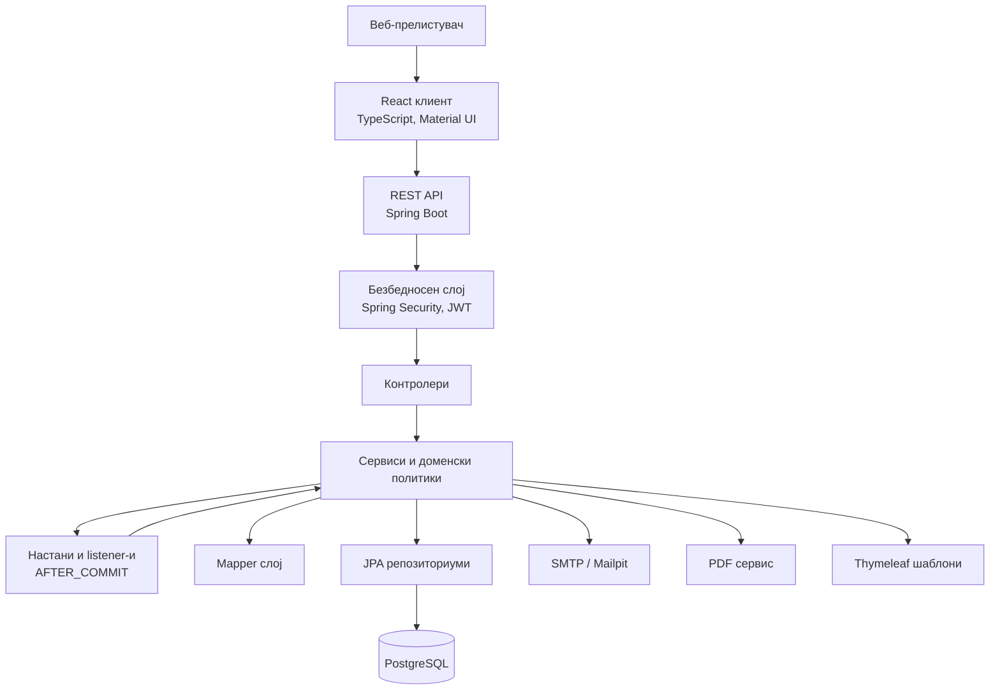
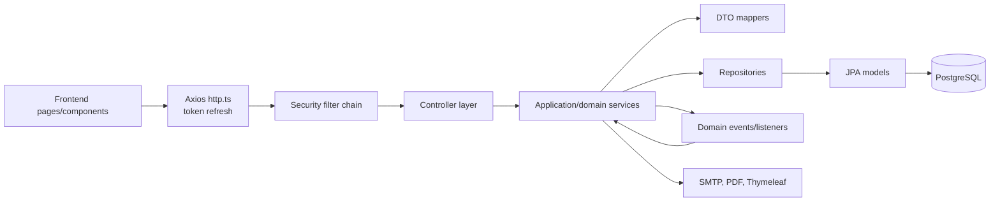
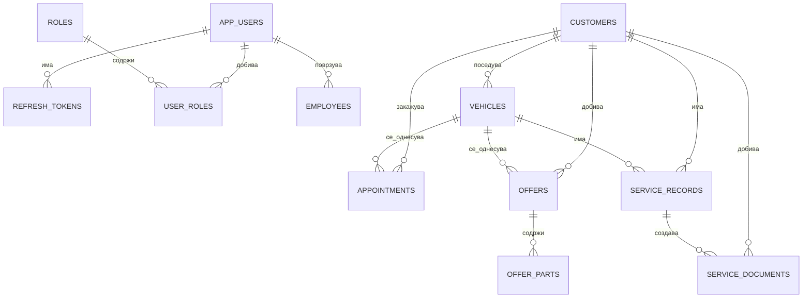
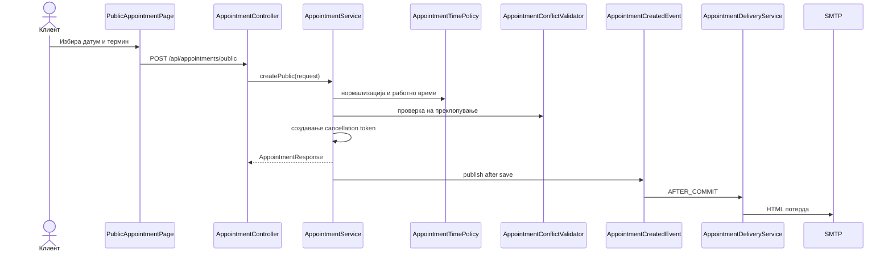
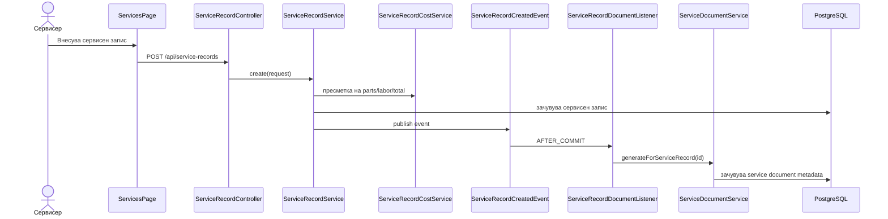
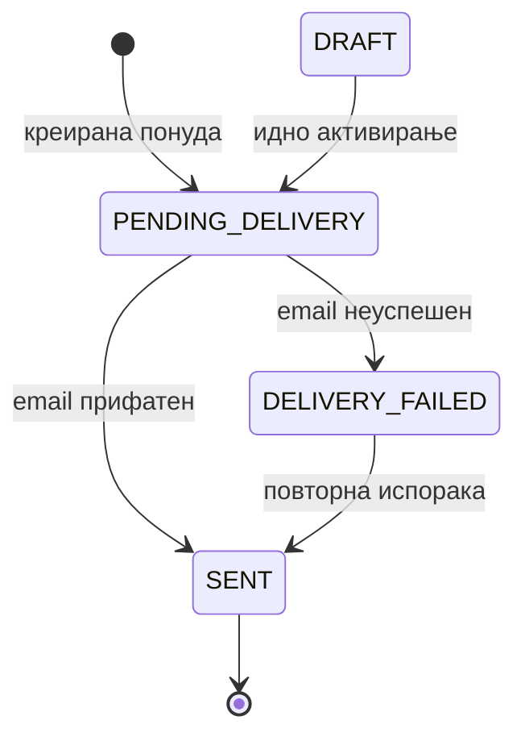

# **Спецификација за дизајн на софтвер**

за

**Систем за управување со автомобилски сервиси и сервисна историја**

Верзија: 1.1

Автор: Стојан Делеников

Датум: 19.06.2026

Ознака на документ: SDS-CARCARE

---

## **Историја на ревизии**

| Датум | Верзија | Опис | Автор |
|---|---:|---|---|
| 17.06.2026 | 1.0 | Почетна верзија на SDS документот | Стојан Делеников |
| 19.06.2026 | 1.1 | Ажурирање по реорганизација на backend структурата, воведување mapper слој, event-driven delivery процеси, пагинација и централизирани API грешки | Стојан Делеников |

---

## **Содржина**

| Поглавје | Наслов |
|---:|---|
| 1 | Вовед |
| 2 | Преглед на системот |
| 3 | Дизајнерски размислувања |
| 3.1 | Претпоставки и зависности |
| 3.2 | Општи ограничувања |
| 3.3 | Цели и насоки |
| 3.4 | Методи на развој |
| 4 | Архитектонски стратегии |
| 5 | Архитектура на системот |
| 5.1 | Архитектура на потсистемите |
| 6 | Политики и тактики |
| 7 | Детален дизајн на системот |
| 7.1 | Главни бизнис модули |
| 7.2 | Технички слоеви и поддржувачки потсистеми |
| 8 | Поимник |
| 9 | Библиографија |

---

## **1. Вовед**

Овој документ претставува спецификација за дизајн на софтвер за системот за управување со автомобилски сервиси и сервисна историја. Документот го опишува техничкиот дизајн на системот, односно начинот на кој функционалните и нефункционалните барања од спецификацијата на барања се претвораат во конкретна архитектура, компоненти, интерфејси, податочен модел и политики за имплементација.

Целта на документот е да обезбеди доволно детален, но одржлив опис на системот, така што нов член на развојниот тим, тестер, ментор или оценувач да може да ја разбере организацијата на апликацијата без претходно да го анализира целиот изворен код. Документот служи и како доказ дека дизајнот ја следи намената опишана во SRS документот: дигитализација на процесите во автомобилски сервис, управување со клиенти и возила, евиденција на сервисна историја, управување со термини, понуди, сервисни документи и лојалност.

Опфатот на документот ги вклучува клиентската веб-апликација, серверската Spring Boot апликација, релациската база на податоци, безбедносниот модел, интеграцијата со електронска пошта, генерирањето PDF документи, обработката на грешки и тестирачките аспекти што влијаат врз дизајнот. Документот не опишува административен план, распоред на развој или комерцијален план, туку се фокусира на софтверскиот дизајн.

Системот е идентификуван како **Систем за управување со автомобилски сервиси и сервисна историја**, верзија 1.0 на апликацијата и верзија 1.1 на овој документ. Документот е наменет за развојниот тим, тестерите, професорот/менторот, проектниот оценувач и сите засегнати страни што треба да ја разберат техничката поставеност на системот.

Документот се темели врз следните извори:

| Референца | Опис |
|---|---|
| `docs/srs_mk.md` | Спецификација на софтверски барања за системот. |
| `docs/mini_specification_mk.md` | Почетен опис на системот, корисниците, функционалностите и технологиите. |
| `docs/business-rules.md` | Правила за JWT автентикација, освежувачки токени и испорака на понуди. |
| `docs/spec-implementation-check.md` | Проверка на имплементацијата и забележани технички празнини. |
| `AGENTS.md` | Проектни правила за архитектура, пакети, DTO, мапирање, тестирање и чист код. |
| IEEE 1016 | Референтен стандард за опис на софтверски дизајн. |
| Brad Appleton SDS Template | Структура за Software Design Specification користена како организациски модел. |

Останатиот дел од документот ги следи главните поглавја од SDS стандардната структура: преглед на системот, дизајнерски размислувања, архитектонски стратегии, системска архитектура, архитектура на потсистеми, политики и тактики, детален дизајн, поимник и библиографија.

---

## **2. Преглед на системот**

Системот за управување со автомобилски сервиси и сервисна историја е веб-базирана апликација наменета за централизирано водење на податоци во рамки на автомобилски сервис. Тој ја заменува хартиената и неструктурираната електронска евиденција со единствен систем за клиенти, возила, сервисни интервенции, термини, понуди, сервисни документи и попусти за лојални клиенти.

Системот е организиран како модуларна клиент-сервер апликација. Клиентската страна е React апликација што се извршува во веб-прелистувач. Серверската страна е Spring Boot апликација што обезбедува REST програмски интерфејс, безбедносна контрола, деловна логика, persistence слој и интеграции. Податоците се чуваат во PostgreSQL база на податоци, а промените во структурата на базата се управуваат преку Flyway миграции.

Главните функционални области се:

- најава, освежување на токен, одјава и промена на лозинка;
- управување со системски корисници, вработени и улоги;
- управување со клиенти и нивните контакт податоци;
- управување со возила и пребарување по VIN, регистарска таблица или сопственик;
- закажување термини, приказ на слободни термини, презакажување и откажување преку временски ограничен линк;
- испраќање потврди и потсетници за термини;
- евиденција на сервисни записи со делови, работна рака, километража и вкупна цена;
- автоматско создавање сервисен документ по успешно зачуван сервисен запис;
- креирање понуди со делови, работна рака, меѓузбир, попуст и конечна цена;
- автоматска или рачна испорака на понуди по електронска пошта;
- PDF извоз на понуди и сервисни документи;
- пресметка на лојалност врз основа на завршени сервисни записи;

Главните кориснички класи се администратор, сервисер и клиент. Администраторот управува со системските корисници. Сервисерот ја користи апликацијата за оперативна работа со клиенти, возила, термини, сервиси, понуди и документи. Клиентот е надворешен актер кој нема корисничка сметка, но може јавно да закаже термин, да добие електронска порака и да откаже термин преку безбеден линк.

Општата организација на системот е прикажана во следниот дијаграм:



Системот по реорганизацијата е модуларен монолит. Сите функционалности се во една Spring Boot апликација, но се раздвоени по функционални пакети: `auth`, `user`, `customer`, `vehicle`, `appointment`, `servicerecord`, `offer`, `document` и `loyalty`. Заедничката инфраструктура е издвоена во `common`, `config`, `security`, `notification` и `audit`.

---

## **3. Дизајнерски размислувања**

Ова поглавје ги опишува претпоставките, ограничувањата, целите и методите што влијаат врз дизајнот пред да се дефинира целосното решение.

### **3.1 Претпоставки и зависности**

| Претпоставка или зависност | Влијание врз дизајнот |
|---|---|
| Системот во првата верзија е наменет за еден автомобилски сервис. | Не се воведува изолација на податоци по повеќе организации или повеќе сервисни центри. |
| Корисниците пристапуваат преку современ веб-прелистувач. | Клиентската страна се изведува како едностранична веб-апликација. |
| Клиентите немаат трајни кориснички сметки. | Јавниот дел е ограничен на закажување термин и откажување преку токен. |
| SMTP сервисот е достапен. | Потврдите, потсетниците, понудите и сервисните документи може да се испраќаат по електронска пошта. |
| PostgreSQL е главна база на податоци. | Доменските објекти се моделираат како релациски ентитети со странски клучеви и индекси. |
| Flyway управува со структурата на базата. | Промените во табелите и индексите се верзионирани преку миграции. |
| Системот користи временска зона Europe/Skopje. | Термините, календарот, email пораките и JSON датумите се нормализираат во истата временска зона. |
| Надворешните ефекти не треба да ја блокираат главната трансакција. | Испораката на електронска пошта и создавањето документи се активираат преку `@TransactionalEventListener` по успешно потврдување на трансакцијата. |

Тековната имплементација користи Java 21, Spring Boot 4.0.6, Spring Security, Spring Data JPA, Hibernate, PostgreSQL, Flyway, Spring Mail, Thymeleaf, OpenPDF, React 19, TypeScript, Vite, Material UI, TanStack Query, Axios, JUnit 5, Mockito, Testcontainers, Vitest и Playwright.

### **3.2 Општи ограничувања**

Следните ограничувања значително влијаат врз дизајнот:

| Ограничување | Објаснување |
|---|---|
| Клиент-сервер комуникација | Клиентската апликација не пристапува директно до базата; сите операции минуваат преку REST API. |
| Clean Architecture слоеви | Контролерите се тенки, сервисите ја содржат деловната логика, репозиториумите управуваат со persistence. |
| DTO договори | Ентитетите не се изложуваат директно преку API; барањата и одговорите се дефинирани како DTO records. |
| Mapper слој | Конверзијата меѓу ентитети и DTO се издвојува во mapper класи. |
| Безсостојбена автентикација | Серверот не користи HTTP сесии, туку JWT пристапни токени и освежувачки токени. |
| Релациска конзистентност | Клиент, возило, термин, сервисен запис, понуда и документ се поврзани со странски клучеви. |
| Парични вредности | Се користи `BigDecimal`, со нормализирање на scale 2 и заокружување `HALF_UP`. |
| Пагинација | За големи колекции се користи `PageResponse`, особено кај сервисни записи и понуди. |
| Надворешни ефекти | Email испорака и автоматско создавање документ се повикуваат по успешен commit. |
| API верзионирање | Проектното правило бара `/api/v1/`, но тековните контролери користат `/api/...`; ова е документирана техничка неусогласеност за идно усогласување. |
| Идентификатори | Проектното правило бара UUID, но тековниот `BaseEntity` користи `Long` со identity генерирање; ова е документирана техничка неусогласеност. |

Системот не обработува електронски плаќања, не се поврзува со платежни процесори и не складира податоци за платежни картички. Плаќањето се изведува физички во сервисот и е надвор од опсегот на тековната верзија.

### **3.3 Цели и насоки**

Дизајнот е воден од следните цели:

| Цел | Насока |
|---|---|
| Разбирлива модуларност | Системот е модуларен монолит со feature пакети и јасни subpackages. |
| Одржливост | Се применуваат мали сервиси, mapper слој, domain exceptions и централизирана обработка на грешки. |
| Безбедност | Се користат JWT, BCrypt, RBAC, валидација на барања и логирање без чувствителни податоци. |
| Тестливост | Деловната логика е издвоена во сервиси, validators и policy класи што може изолирано да се тестираат. |
| Конзистентност на податоци | Главните промени се трансакциски, а споредните ефекти се активираат по commit. |
| Перформанси | За големи листи се користи пагинација и `EntityGraph`/двочекорно вчитување за да се намали N+1 проблемот. |
| Проширливост | Delivery сервисите, renderer-ите и listener-ите овозможуваат идни канали како SMS или object storage. |
| Академска читливост | Документот го објаснува дизајнот формално, но не копира изворен код што лесно се чита од репозиториумот. |

### **3.4 Методи на развој**

Дизајнот користи итеративен и објектно-ориентиран пристап. Функционалностите се развиваат по доменски модули и се потврдуваат со тестови. Архитектурата не се врзува за строго формална методологија, но ги следи принципите на чист код, SOLID, Clean Architecture и стандардните практики на Spring Boot.

Развојот е организиран околу следните практики:

- функционално ориентирана модуларна монолитна организација;
- слоевита поделба на контролери, сервиси, репозиториуми, модели, DTO и mapper-и;
- domain-specific exceptions и централизирана обработка на API грешки;
- кратки трансакции во сервисниот слој;
- тек на работа управуван од настани за електронска пошта и документ операции по успешно потврдување на трансакцијата;
- Flyway миграции за база;
- единични, интеграциски и e2e тестови.

---

## **4. Архитектонски стратегии**

### **4.1 Модуларен монолит наместо распределен систем**

Системот е дизајниран како модуларен монолит. Ова значи дека сите функционалности се извршуваат во една серверска апликација, но кодот е строго поделен по домени. Овој избор ја намалува инфраструктурната сложеност во факултетски проект, а сепак создава јасни граници за идно издвојување на сервиси ако системот порасне.

Разгледана алтернатива е микросервисна архитектура. Таа е отфрлена за оваа верзија бидејќи би внела дополнителна сложеност во комуникација, deployment, мониторинг и трансакциска конзистентност, без да донесе пропорционална корист за систем наменет за еден сервисен центар.

### **4.2 Функционално ориентирана серверска структура**

Серверскиот код е реорганизиран во функционални пакети. Секој модул ги содржи само потпакетите што му се потребни:

```text
<feature>/
|-- controller/
|-- service/
|-- repository/
|-- model/
|-- dto/
|   |-- request/
|   `-- response/
|-- mapper/
|-- event/
|-- exception/
`-- scheduler/
```

Оваа стратегија ја прави структурата појасна од претходната организација со класи директно во feature пакетот. Новите класи како `OfferPricingService`, `OfferDeliveryService`, `AppointmentConflictValidator`, `ServiceDocumentPdfExporter` и mapper класите го намалуваат обемот на главните сервисни класи.

### **4.3 Слоевита комуникација и DTO договори**

Контролерите примаат DTO барања, сервисите работат со ентитети и деловни правила, mapper-ите создаваат DTO одговори, а репозиториумите пристапуваат до базата. Ентитетите не се враќаат директно кон frontend-от. Ова ја намалува поврзаноста меѓу persistence моделот и надворешниот API договор.

### **4.4 Споредни ефекти управувани од настани**

Испраќањето електронска пошта и создавањето сервисен документ се третираат како споредни ефекти што треба да се случат по успешно потврдување на трансакцијата. За таа цел се користи `ApplicationEventPublisher` и `@TransactionalEventListener(phase = TransactionPhase.AFTER_COMMIT)`.

Примери:

- `AppointmentCreatedEvent` иницира испраќање потврда за термин;
- `ServiceRecordCreatedEvent` иницира генерирање сервисен документ;
- `OfferCreatedEvent` иницира испорака на понуда.

Оваа стратегија го спречува случајот во кој електронска порака би се испратила за запис што подоцна не е трајно зачуван во базата.

### **4.5 Испорака со статуси и идемпотентна заштита**

Понудите користат статуси `DRAFT`, `PENDING_DELIVERY`, `SENT` и `DELIVERY_FAILED`. Нова понуда се зачувува како `PENDING_DELIVERY`, а listener-от за испорака се обидува да ја испрати по успешно потврдување на трансакцијата. Ако испораката успее, статусот станува `SENT`; ако не успее, станува `DELIVERY_FAILED`.

`OfferDeliveryService` спречува паралелна испорака за истата понуда преку сет на испораки во тек и не дозволува нормално повторно испраќање на веќе испратена понуда. Ова го намалува ризикот од дупли електронски пораки.

### **4.6 Пагинација и контролирано вчитување**

За листи што може да растат, како понуди и сервисни записи, се користи `PageResponse`. Репозиториумите користат страници со идентификатори и потоа вчитуваат детални ентитети со `EntityGraph` или посебни методи, со што се намалува ризикот од N+1 queries и се зачувува редоследот на страницата.

### **4.7 Централизирана обработка на грешки**

Системот користи `ApiException` хиерархија со `ResourceNotFoundException`, `ValidationException`, `BusinessRuleException`, `ConflictException` и `ExternalServiceException`. `GlobalExceptionHandler` враќа конзистентен `ApiErrorResponse` со timestamp, status, error, message, path и fieldErrors. Така frontend-от може унифицирано да прикажува грешки.

### **4.8 Стратегија за кориснички интерфејс**

Клиентската апликација користи React, Material UI, React Router, TanStack Query и Axios. `http.ts` управува со пристапни и освежувачки токени, автоматско освежување пред истек и повторување на првичното барање по 401 одговор. `modules.ts` врши мапирање меѓу backend DTO и frontend типови.

---

## **5. Архитектура на системот**

Системот е поделен на презентациски слој, API слој, безбедносен слој, сервисен слој, mapper слој, persistence слој, база на податоци и интеграциски компоненти.



Најважните одговорности на системско ниво се:

- безбедна идентификација на системските корисници;
- ограничување на пристапот според улоги;
- управување со главните доменски податоци;
- зачувување историски записи;
- спречување конфликтни термини;
- пресметка на финансиски износи и попусти;
- испорака на email пораки и PDF документи;
- конзистентна обработка на грешки;
- логирање без изложување чувствителни податоци.

### **5.1 Архитектура на потсистемите**

| Потсистем | Главна одговорност | Клучни пакети и класи |
|---|---|---|
| Автентикација и безбедност | Најава, refresh, logout, промена лозинка, JWT проверка | `auth/controller`, `auth/service`, `auth/model`, `security`, `SecurityConfig` |
| Корисници и администрација | Управување со системски корисници, вработени и улоги | `user/controller`, `user/service`, `user/model`, `user/repository`, `user/dto` |
| Клиенти | CRUD, пребарување и меко бришење клиенти | `customer/controller`, `customer/service`, `customer/model`, `customer/repository` |
| Возила | CRUD и пребарување возила, врска со клиент | `vehicle/controller`, `vehicle/service`, `vehicle/model`, `vehicle/repository` |
| Термини | Слободни слотови, јавна резервација, презакажување, откажување и потсетници | `appointment/controller`, `appointment/service`, `appointment/event`, `appointment/scheduler` |
| Сервисни записи | Сервисна историја, трошоци, настан за документ | `servicerecord/controller`, `servicerecord/service`, `servicerecord/event`, `servicerecord/mapper` |
| Понуди | Цени, делови, попусти, delivery статуси, email и PDF | `offer/controller`, `offer/service`, `offer/event`, `offer/mapper` |
| Документи | Метаподатоци, PDF извоз, email со attachment | `document/controller`, `document/service`, `document/model`, `document/mapper` |
| Лојалност | Пресметка на статус на лојален клиент | `loyalty/service`, `loyalty/dto` |
| Ревизија | Запис на значајни настани | `audit`, audit fields во `BaseEntity` |
| Notification инфраструктура | HTML email, attachment email, PDF rendering | `notification`, `templates/*.html` |
| Common инфраструктура | API одговори, грешки, лог sanitizer, пагинација | `common` |

Подсистемите соработуваат преку сервисни зависности и настани. На пример, `ServiceRecordService` не го гради документот директно во истата трансакција, туку објавува `ServiceRecordCreatedEvent`, кој по commit го обработува `ServiceRecordDocumentListener`. Оваа соработка ја подобрува конзистентноста и ја намалува поврзаноста меѓу сервисните записи и документите.

---

## **6. Политики и тактики**

### **6.1 Технологии и алатки**

| Област | Тековна имплементација |
|---|---|
| Backend | Java 21, Spring Boot 4.0.6, Spring Security, Spring Data JPA, Hibernate |
| Frontend | React 19, TypeScript, Vite, Material UI, React Router, TanStack Query, Axios |
| База | PostgreSQL, Flyway миграции, Hibernate `ddl-auto: validate` |
| Email | Spring Mail, SMTP, Mailpit во локална околина, Thymeleaf шаблони |
| PDF | OpenPDF преку `PdfService` и специјализирани exporter сервиси |
| Тестирање | JUnit 5, Mockito, Testcontainers, Vitest, React Testing Library, Playwright |
| Документација | Markdown, Mermaid дијаграми, OpenAPI/Swagger |

### **6.2 Организација на изворен код**

Серверската апликација се организира како функционално ориентиран модуларен монолит. Заедничката инфраструктура е во врвни пакети `common`, `config`, `security`, `notification` и `audit`, а доменските функционалности се во функционални пакети. Моделите се во `model`, DTO records во `dto/request` и `dto/response`, перзистенцијата во `repository`, REST адаптерите во `controller`, деловната логика во `service`, а мапирањето во `mapper`.

Клиентската апликација моментално е организирана околу `pages`, `components`, `auth`, `api`, `utils`, `config` и типови. API модулот ја изолира комуникацијата со серверската страна и го мапира серверскиот DTO формат во типови за корисничкиот интерфејс.

### **6.3 Кодирачки политики**

Системот ги следи следните политики:

- контролерите не содржат деловна логика;
- сервисите оркестрираат use-case операции;
- repository класите се користат само за persistence;
- request/response DTO се задолжителни за API;
- mapper класите ја преземаат конверзијата меѓу ентитети и DTO;
- влезните податоци се валидираат на границите со Bean Validation;
- паричните вредности се обработуваат со `BigDecimal`;
- надворешните споредни ефекти не се повикуваат во главната база-трансакција кога не е неопходно;
- грешките се доменски и се мапираат во конзистентен JSON;
- чувствителни податоци, лозинки и токени не се логираат.

### **6.4 Политика за API одговори и грешки**

Успешните API одговори користат `ApiResponse<T>`, а грешките користат `ApiErrorResponse`. За колекции што се страници се користи `PageResponse<T>`, кој содржи `content`, `page`, `size`, `totalElements`, `totalPages` и `last`.

Валидациските грешки враќаат `fieldErrors`, што овозможува frontend формите да прикажуваат грешки покрај конкретни полиња. Ова е поддржано и од frontend utility `apiFormErrors.ts`.

### **6.5 Политика за испорака на пораки и документи**

Содржината за електронска пошта не се гради директно во главните доменски сервиси. Се користат renderer-и и Thymeleaf шаблони:

- `AppointmentEmailRenderer` за потврди и потсетници;
- `OfferEmailRenderer` за понуди;
- `ServiceDocumentEmailRenderer` за сервисни документи;
- `service-document-email.html`, `offer-email.html` и `appointment-confirmation-email.html` како шаблони.

Понудите се испорачуваат со статуси. Сервисните документи се испраќаат со PDF attachment генериран од `ServiceDocumentPdfExporter`.

### **6.6 Политика за тестирање**

Тестирањето е поделено на:

- единични тестови за сервиси, renderer-и, delivery сервиси, cost/pricing логика и log sanitizer;
- интеграциски тестови со PostgreSQL Testcontainers за целосни backend текови;
- frontend тестови со Vitest и React Testing Library;
- e2e тестови со Playwright за најважните кориснички сценарија.

Посебно се тестираат нормални, валидациски, авторизациски и not-found случаи, како и delivery failure сценарија.

### **6.7 Политика за градење и извршување**

Серверската апликација се гради со Maven. Клиентската апликација се гради со Vite. Локалната инфраструктура користи Docker Compose за PostgreSQL и Mailpit. Во продукциска околина треба да се користат променливи на околина или систем за тајни за лозинки, JWT тајна и SMTP податоци.

---

## **7. Детален дизајн на системот**

Ова поглавје ги опишува главните системски компоненти според атрибутите од SDS шаблонот: класификација, дефиниција, одговорности, ограничувања, состав, интеракции и зависности, ресурси, процесирање и интерфејси. Примарната поделба е направена според доменските модули што ја носат бизнис логиката на системот, а потоа се наведени техничките слоеви и поддржувачките потсистеми што ја овозможуваат нивната реализација.

### **7.1 Главни бизнис модули**

Системот е организиран како модуларен монолит со јасно издвоени функционални модули. Главните модули поврзани со бизнис логиката се: автентикација и авторизација, управување со корисници и привилегии, клиенти, возила, сервисни термини, сервисни записи, сервисни документи, сервисни понуди и лојалност со попусти. Во претходниот список модулот за автентикација беше наведен двапати; во овој документ тој се третира како еден безбедносен модул. Дополнително, лојалноста и попустите се издвојуваат како посебен бизнис модул бидејќи се наведени како функционална област во SRS и mini specification документите.

Поддржувачките потсистеми, како известувања по електронска пошта, генерирање PDF документи, ревизиски записи, глобална обработка на грешки и заедничка пагинација, не се основни доменски модули сами по себе. Тие сепак се значајни за извршување на бизнис процесите и се документирани во поглавјето 7.2.

Во тековната имплементација REST патеките се изложени под `/api/...`. Проектното правило за идната стабилизирана верзија бара верзионирање под `/api/v1/...`, па ова претставува техничко усогласување што треба да се изведе без промена на доменската поделба опишана во ова поглавје.

#### **7.1.1 Модул за автентикација и авторизација**

| Атрибут | Опис |
|---|---|
| Класификација | Безбедносен и апликациски модул што обезбедува идентификација на корисници, проверка на пристап и управување со сесиски токени. |
| Дефиниција | Модулот овозможува најава, одјава, освежување на пристапен токен и промена на лозинка. Тој користи JWT токени, освежувачки токени и Spring Security инфраструктура за да обезбеди контролиран пристап до заштитените ресурси. |
| Одговорности | Проверка на кориснички креденцијали; генерирање пристапен и освежувачки токен; поништување активни освежувачки токени при одјава и промена на лозинка; вчитување кориснички улоги; поставување безбедносен контекст за заштитените барања. |
| Ограничувања | Лозинките не се складираат во изворна форма, туку како BCrypt хеш. Пристапниот токен има ограничено времетраење, освежувачкиот токен се чува во база на податоци, а административните ресурси се достапни само за корисници со соодветна улога. |
| Состав | `AuthController`, `AuthService`, `JwtService`, `JwtAuthenticationFilter`, `SecurityConfig`, `CarcareUserDetailsService`, `RefreshTokenRepository`, `RefreshToken`, `LoginRequest`, `RefreshRequest`, `ChangePasswordRequest`, `AuthResponse`. |
| Интеракции и зависности | Зависи од модулот за корисници за вчитување на `AppUser` и улоги, од PostgreSQL за освежувачки токени, од BCrypt за проверка на лозинки и од Spring Security за филтрирање на HTTP барањата. Сите останати заштитени модули индиректно зависат од овој модул бидејќи го користат безбедносниот контекст. |
| Ресурси | Табела `refresh_tokens`, табели `app_users`, `roles` и `user_roles`, JWT тајна, системско време за проверка на истекување, HTTP `Authorization` заглавие и безбедносен контекст. |
| Процесирање | Корисникот испраќа е-пошта и лозинка. Сервисот го вчитува корисникот, ја споредува лозинката со BCrypt хешот, генерира токени и го зачувува освежувачкиот токен. При наредни барања JWT филтерот го проверува токенот и го поставува тековниот корисник во безбедносниот контекст. |
| Интерфејси | `POST /api/auth/login`, `POST /api/auth/refresh`, `POST /api/auth/logout`, `POST /api/auth/change-password`. |

#### **7.1.2 Модул за управување со корисници и привилегии**

| Атрибут | Опис |
|---|---|
| Класификација | Административен бизнис модул за управување со системски корисници, вработени и нивни улоги. |
| Дефиниција | Модулот овозможува администраторот да креира, изменува, прегледува и деактивира кориснички сметки за сервисери и други овластени лица во системот. |
| Одговорности | Управување со кориснички сметки; доделување улоги; одржување статус на корисник; поврзување корисничка сметка со вработен; обезбедување податоци за авторизација кон безбедносниот модул. |
| Ограничувања | Само администратор може да управува со корисници. Модулот не смее да враќа лозинки или хеширани лозинки во API одговори. Корисничките улоги мора да бидат од контролирано множество. |
| Состав | `AdminUserController`, `UserService`, `AppUserRepository`, `RoleRepository`, `EmployeeRepository`, `AppUser`, `Role`, `Employee`, `UserRequest`, `UserUpdateRequest`, `UserResponse`. |
| Интеракции и зависности | Соработува со модулот за автентикација при најава и проверка на улоги. Го користи persistence слојот за корисници, улоги и вработени, а глобалната обработка на грешки се користи за невалидни или непостоечки корисници. |
| Ресурси | Табели `app_users`, `roles`, `user_roles` и `employees`, BCrypt encoder за нови лозинки, административен JWT контекст. |
| Процесирање | Администраторот испраќа барање за корисник. Сервисот ги валидира податоците, ја хешира лозинката кога се поставува нова лозинка, ги поврзува улогите и го зачувува корисникот преку repository. Одговорот се враќа како DTO без чувствителни податоци. |
| Интерфејси | `/api/admin/users` за административни CRUD операции и `UserService` како апликациски интерфејс кон другите модули. |

#### **7.1.3 Модул за клиенти**

| Атрибут | Опис |
|---|---|
| Класификација | Доменски модул за управување со надворешни клиенти на автомобилскиот сервис. |
| Дефиниција | Модулот ја претставува централната евиденција на лица или организации кои носат возила на сервис, добиваат понуди, документи и известувања. |
| Одговорности | Креирање, измена, преглед и пребарување клиенти; чување контакт податоци; поддршка за мека деактивација; обезбедување клиентски податоци за возила, термини, записи, понуди, документи и лојалност. |
| Ограничувања | Е-поштата и телефонските податоци мора да бидат валидни кога се користат за испорака на известувања. Клиент со поврзани записи не треба физички да се отстранува ако тоа би ја нарушило сервисната историја. |
| Состав | `CustomerController`, `CustomerService`, `CustomerRepository`, `Customer`, `CustomerRequest`, `CustomerResponse`, `CustomerNotFoundException`. |
| Интеракции и зависности | Модулот се користи од модулите за возила, термини, сервисни записи, понуди, документи и лојалност. Зависи од repository слојот и од глобалната обработка на грешки за неуспешни пребарувања. |
| Ресурси | Табела `customers`, индекси за пребарување по име, презиме, е-пошта или телефон, audit полиња од `BaseEntity`. |
| Процесирање | При внес или измена се валидираат задолжителните податоци и контакт информациите. Сервисот ја применува деловната логика за активен или неактивен клиент, зачувува преку repository и враќа `CustomerResponse`. |
| Интерфејси | `/api/customers` за листа, пребарување, додавање, измена, преглед и бришење или деактивација на клиент. |

#### **7.1.4 Модул за возила**

| Атрибут | Опис |
|---|---|
| Класификација | Доменски модул за управување со возила поврзани со клиенти. |
| Дефиниција | Модулот ја одржува евиденцијата за возилата што се сервисираат, вклучувајќи идентификациски податоци, технички карактеристики и сопственик. |
| Одговорности | Креирање и измена на возило; поврзување со клиент; пребарување по VIN, регистарска табличка или сопственик; обезбедување податоци за термини, сервисни записи, понуди и документи. |
| Ограничувања | VIN и регистарската табличка мора да бидат единствени кога тоа е дел од деловното правило. Возило не може да се поврзе со непостоечки или неактивен клиент. |
| Состав | `VehicleController`, `VehicleService`, `VehicleRepository`, `Vehicle`, `VehicleRequest`, `VehicleResponse`, `VehicleNotFoundException`. |
| Интеракции и зависности | Зависи од модулот за клиенти за проверка на сопственик. Се користи од модулите за сервисни термини, сервисни записи, понуди и документи. |
| Ресурси | Табела `vehicles`, врска кон `customers`, индекси за VIN и регистарска табличка, audit полиња. |
| Процесирање | При внес на возило сервисот го вчитува клиентот, ги проверува идентификациските податоци, го зачувува возилото и го враќа преку DTO. При пребарување се користат експлицитни параметри за филтрирање. |
| Интерфејси | `/api/vehicles` за CRUD операции и пребарување според VIN, регистарска табличка или сопственик. |

#### **7.1.5 Модул за сервисни термини**

| Атрибут | Опис |
|---|---|
| Класификација | Доменски модул за планирање и управување со сервисни термини. |
| Дефиниција | Модулот го опфаќа процесот на резервирање, презакажување, откажување и потврдување на термини за сервисирање возила. |
| Одговорности | Приказ на слободни термини; креирање јавен или внатрешен термин; проверка на временски конфликт; управување со статус; генерирање токен за откажување; испраќање потврди и потсетници. |
| Ограничувања | Не смее да се дозволи преклопување на активни термини во исти временски прозорци. Јавното откажување мора да биде ограничено со валиден токен и временски рок. Испраќањето известувања не треба да ја блокира главната трансакција. |
| Состав | `AppointmentController`, `AppointmentService`, `PublicAppointmentBookingService`, `AppointmentTimePolicy`, `AppointmentConflictValidator`, `AppointmentCancellationTokenService`, `AppointmentDeliveryService`, `AppointmentReminderScheduler`, `AppointmentConfirmationListener`, `AppointmentRepository`, `Appointment`, `AppointmentStatus`, `AppointmentRequest`, `PublicAppointmentRequest`, `AppointmentResponse`. |
| Интеракции и зависности | Зависи од модулите за клиенти и возила, од `notification` потсистемот за е-пошта и од event listener-и за пост-трансакциска испорака на потврди. |
| Ресурси | Табела `appointments`, системско време, SMTP сервер, шаблони за е-пошта, scheduler за потсетници, cancellation token. |
| Процесирање | При креирање термин сервисот ги проверува клиентот, возилото и временскиот прозорец, валидира конфликт, го зачувува терминот и објавува настан. По успешен commit listener испраќа потврда. Scheduler периодично избира термини за кои треба потсетник. |
| Интерфејси | `/api/appointments`, јавни патеки за достапност, јавна резервација и откажување, како и сервисни методи за потврди и потсетници. |

#### **7.1.6 Модул за сервисни записи**

| Атрибут | Опис |
|---|---|
| Класификација | Централен доменски модул за сервисна историја и извршени интервенции. |
| Дефиниција | Модулот ги претставува завршените или евидентираните сервисни активности за одредено возило и клиент, вклучувајќи опис на услуга, километража, делови, работна рака и вкупна цена. |
| Одговорности | Креирање сервисен запис; пресметка на вкупен трошок; преглед и пребарување сервисна историја; обезбедување основа за автоматско креирање сервисен документ и за пресметка на лојалност. |
| Ограничувања | Записот мора да биде поврзан со постоечки клиент и возило. Паричните вредности се обработуваат со `BigDecimal`. Не смее да се зачува запис со невалидна километража или негативни трошоци. |
| Состав | `ServiceRecordController`, `ServiceRecordService`, `ServiceRecordCostService`, `ServiceRecordMapper`, `ServiceRecordRepository`, `ServiceRecord`, `ServiceRecordCreatedEvent`, `ServiceRecordDocumentListener`, `ServiceRecordRequest`, `ServiceRecordResponse`. |
| Интеракции и зависности | Зависи од модулите за клиенти и возила. Објавува настан кон модулот за сервисни документи. Се користи од модулот за лојалност. |
| Ресурси | Табела `service_records`, врски кон `customers` и `vehicles`, `PageResponse` за листи, event publisher за пост-трансакциска обработка. |
| Процесирање | Сервисот ги вчитува поврзаните ентитети, ја пресметува цената преку `ServiceRecordCostService`, го зачувува записот и објавува `ServiceRecordCreatedEvent`. По commit се активира создавање сервисен документ. |
| Интерфејси | `/api/service-records` за додавање, преглед, страницирана листа и пребарување на сервисни записи. |

#### **7.1.7 Модул за сервисни документи**

| Атрибут | Опис |
|---|---|
| Класификација | Доменско-документарен модул за официјални сервисни потврди и нивна испорака. |
| Дефиниција | Модулот креира и управува со сервисни документи што произлегуваат од сервисен запис и служат како формална потврда за извршената услуга. |
| Одговорности | Автоматско создавање документ по сервисен запис; чување метаподатоци; подготовка на приказ за документ; генерирање PDF; испраќање документ до клиент по е-пошта; враќање документски DTO кон клиентската апликација. |
| Ограничувања | Документ не смее да се креира без валиден сервисен запис. PDF генерирањето и испраќањето по е-пошта треба да бидат издвоени од главната трансакција кога се резултат на настан. |
| Состав | `ServiceDocumentController`, `ServiceDocumentService`, `ServiceDocumentViewFactory`, `ServiceDocumentPdfExporter`, `ServiceDocumentEmailRenderer`, `ServiceDocumentDeliveryService`, `ServiceDocumentMapper`, `ServiceDocumentRepository`, `ServiceDocument`, `ServiceDocumentView`, `DocumentType`, `ServiceDocumentRequest`, `ServiceDocumentResponse`. |
| Интеракции и зависности | Зависи од сервисните записи, клиентите и возилата. Користи `PdfService`, `HtmlAttachmentEmailSender` и шаблони за е-пошта и документ. |
| Ресурси | Табела `service_documents`, PDF renderer, SMTP сервер, HTML/Thymeleaf шаблони, врска кон `service_records`. |
| Процесирање | По прием на настан за креиран сервисен запис се подготвува документ, се зачувуваат метаподатоци и се овозможува PDF извоз. При испорака се генерира PDF прилог и се испраќа HTML порака до клиентот. |
| Интерфејси | `/api/documents` за преглед, креирање, преземање PDF и испраќање сервисен документ. |

#### **7.1.8 Модул за сервисни понуди**

| Атрибут | Опис |
|---|---|
| Класификација | Доменски модул за креирање, пресметка и испорака на понуди за сервис или резервни делови. |
| Дефиниција | Модулот овозможува сервисерот да креира понуда за клиент и возило, со ставки за делови, работна рака, меѓузбир, попуст и конечна цена. |
| Одговорности | Креирање понуда; пресметка на цени и попусти; управување со статуси `DRAFT`, `PENDING_DELIVERY`, `SENT` и `DELIVERY_FAILED`; испорака по е-пошта; PDF извоз; спречување двојна испорака. |
| Ограничувања | Паричните вредности мора да се обработуваат со `BigDecimal`. Понуда не може да се испрати ако клиентот нема валидна е-пошта. Надворешното испраќање се изведува по commit или во посебна обработка за да не ја држи главната трансакција. |
| Состав | `OfferController`, `OfferService`, `OfferPricingService`, `OfferDeliveryService`, `OfferEmailRenderer`, `OfferDeliveryListener`, `OfferMapper`, `OfferRepository`, `Offer`, `OfferPart`, `OfferEmail`, `OfferStatus`, `OfferCreatedEvent`, `OfferRequest`, `OfferPartRequest`, `OfferResponse`, `OfferPartResponse`. |
| Интеракции и зависности | Зависи од модулите за клиенти и возила, од модулот за лојалност за пресметка на попуст, од `notification` потсистемот за е-пошта и од PDF сервисот за извоз. |
| Ресурси | Табели `offers` и `offer_parts`, SMTP сервер, HTML шаблони за понуда, PDF renderer, event publisher. |
| Процесирање | При креирање понуда сервисот ги вчитува клиентот и возилото, ја пресметува цената преку `OfferPricingService`, поставува статус `PENDING_DELIVERY` кога треба испорака и објавува `OfferCreatedEvent`. Listener по commit повикува `OfferDeliveryService`, кој ја ажурира состојбата во `SENT` или `DELIVERY_FAILED`. |
| Интерфејси | `/api/offers` за креирање, преглед, страницирана листа, испраќање, повторна испорака и PDF извоз. |

#### **7.1.9 Модул за лојалност и попусти**

| Атрибут | Опис |
|---|---|
| Класификација | Доменски аналитички модул за пресметка на лојалност и применливи попусти. |
| Дефиниција | Модулот го анализира бројот и вредноста на претходни сервисни записи за клиентот со цел да утврди дали клиентот има право на попуст или лојален статус. |
| Одговорности | Пресметка на лојален статус; подготовка на `CustomerLoyaltyStatusResponse`; обезбедување информации за попуст кон модулот за понуди; поддршка на бизнис правилата за задржување редовни клиенти. |
| Ограничувања | Пресметката мора да се базира на реално зачувани сервисни записи. Модулот не смее самостојно да менува понуда, туку обезбедува податоци што ги користи модулот за понуди. |
| Состав | `CustomerLoyaltyService`, `CustomerLoyaltyStatusResponse`, зависност кон `ServiceRecordRepository` и доменските податоци за клиент. |
| Интеракции и зависности | Зависи од модулот за сервисни записи и од модулот за клиенти. Се користи од модулот за понуди при пресметка на попусти и може да се користи од корисничкиот интерфејс за приказ на лојален статус. |
| Ресурси | Табела `service_records`, податоци за клиент, деловни прагови за лојалност и попуст. |
| Процесирање | Сервисот ги пребројува релевантните сервисни записи и ја пресметува вредноста што е потребна за статус или попуст. Резултатот се враќа како DTO и потоа се користи во процесот на пресметка на понуда. |
| Интерфејси | Java сервисен интерфејс преку `CustomerLoyaltyService`; резултатот се изложува индиректно преку понуди или преку посебни клиентски прикази кога е потребно. |

### **7.2 Технички слоеви и поддржувачки потсистеми**

#### **7.2.1 Контролерски слој**

| Атрибут | Опис |
|---|---|
| Класификација | REST adapter слој. |
| Дефиниција | Класи со `@RestController` што ги изложуваат HTTP endpoints кон frontend и јавните клиенти. |
| Одговорности | Мапирање на барања, активирање `@Valid`, преземање параметри од патека и пребарување, враќање `ApiResponse`, `PageResponse` или PDF byte response. |
| Ограничувања | Нема деловна логика; не прима и не враќа JPA ентитети. |
| Состав | `AuthController`, `AdminUserController`, `CustomerController`, `VehicleController`, `AppointmentController`, `ServiceRecordController`, `OfferController`, `ServiceDocumentController`. |
| Употреби/Интеракции | Секој контролер повикува соодветен сервис; административните endpoints зависат од Spring Security. |
| Ресурси | HTTP барања, JSON тела, path/query параметри, security context. |
| Обработка | Контролерот прима барање, го валидира форматот, повикува сервис и го обвиткува резултатот во API одговор. |
| Интерфејс/Извоз | Крајните точки се под `/api/...`: `/api/auth`, `/api/customers`, `/api/vehicles`, `/api/appointments`, `/api/service-records`, `/api/offers`, `/api/documents`, `/api/admin/users`. |

#### **7.2.2 Сервисен слој**

| Атрибут | Опис |
|---|---|
| Класификација | Апликациски и доменски сервисен слој. |
| Дефиниција | Класи што ги реализираат use-case операциите и деловните правила. |
| Одговорности | Автентикација, CRUD оркестрација, проверка на сопственост на возило, проверка на термински конфликт, пресметка на цени, лојалност, delivery процеси и објавување настани. |
| Ограничувања | Трансакциите се кратки; надворешните системи се повикуваат по commit или во посебна трансакција кога е потребно. |
| Состав | `AuthService`, `UserService`, `CustomerService`, `VehicleService`, `AppointmentService`, `ServiceRecordService`, `OfferService`, `OfferPricingService`, `OfferDeliveryService`, `ServiceDocumentService`, `ServiceDocumentDeliveryService`, `CustomerLoyaltyService`. |
| Употреби/Интеракции | Користи repository, mapper, event publisher, email sender, PDF exporter и policy/validator класи. |
| Ресурси | База на податоци, SMTP, PDF renderer, Thymeleaf, системско време, криптографски функции. |
| Обработка | Сервисот вчитува ентитети, проверува правила, менува состојба, зачувува преку repository и враќа DTO преку mapper. |
| Интерфејс/Извоз | Јавни Java методи повикани од контролери или event listener-и. |

#### **7.2.3 Репозиториумски и перзистентен слој**

| Атрибут | Опис |
|---|---|
| Класификација | Persistence adapter слој. |
| Дефиниција | Spring Data JPA repository интерфејси за пристап до PostgreSQL. |
| Одговорности | Читање, зачувување, пребарување, пагинација, projection/ID paging и контролирано вчитување на релации. |
| Ограничувања | Не содржи деловни правила. |
| Состав | `CustomerRepository`, `VehicleRepository`, `AppointmentRepository`, `ServiceRecordRepository`, `OfferRepository`, `ServiceDocumentRepository`, `AppUserRepository`, `RoleRepository`, `RefreshTokenRepository`, `AuditEventRepository`. |
| Употреби/Интеракции | Се повикува од сервисниот слој; користи JPA ентитети од `model` пакетите. |
| Ресурси | PostgreSQL табели, индекси, транзакции и JPA EntityManager. |
| Обработка | Извршува query методи, `EntityGraph` вчитување и страници преку `Pageable`. |
| Интерфејс/Извоз | Методи наследени од `JpaRepository` и дополнителни методи за пребарување. |

#### **7.2.4 DTO, мапирачки и моделски слој**

| Атрибут | Опис |
|---|---|
| Класификација | Податочен договор и доменски модел. |
| Дефиниција | DTO records ги претставуваат API барањата и одговорите; JPA models ја претставуваат трајната структура; mapper класите ги поврзуваат. |
| Одговорности | Стабилен API договор, изолација од persistence детали, форматирање на response структури. |
| Ограничувања | DTO не треба да содржи деловна логика; ентитетите не се изложуваат кон API. |
| Состав | `dto/request`, `dto/response`, `model`, `mapper` subpackages во feature модулите. |
| Употреби/Интеракции | Контролери примаат request DTO; сервиси работат со модели; mapper-и создаваат response DTO. |
| Ресурси | Bean Validation annotations, Lombok за ентитети, Java records за DTO. |
| Обработка | Мапирање од ентитет кон response и од request кон промена на ентитет се врши експлицитно во сервис/mapper. |
| Интерфејс/Извоз | DTO records како `CustomerRequest`, `VehicleResponse`, `OfferResponse`, `PageResponse<T>`. |

#### **7.2.5 База на податоци**

Главните табели се:

| Табела | Намена |
|---|---|
| `app_users` | Системски корисници, лозинки, статуси и login метаподатоци. |
| `roles`, `user_roles` | Улоги и поврзување корисник-улога. |
| `employees` | Податоци за вработени. |
| `customers` | Клиенти, контакт податоци и soft-delete ознака. |
| `vehicles` | Возила, VIN, регистарска табличка, мотор, гориво и сопственик. |
| `appointments` | Термини, статуси, временски прозорци, cancellation token и reminder marker. |
| `service_records` | Сервисни записи, делови, работна рака, километража и вкупна цена. |
| `offers` | Понуди, цени, попусти, status и рок. |
| `offer_parts` | Поединечни делови во понуда. |
| `service_documents` | Метаподатоци за сервисни документи. |
| `refresh_tokens` | Освежувачки токени и нивна ревокација. |
| `audit_events` | Ревизиски настани. |



`BaseEntity` обезбедува `id`, `createdAt`, `updatedAt`, `createdBy` и `updatedBy`. Тековниот идентификатор е `Long`, иако проектното правило бара UUID како целна архитектурна насока.

#### **7.2.6 Безбедносен слој**

| Атрибут | Опис |
|---|---|
| Класификација | Security infrastructure. |
| Дефиниција | Spring Security конфигурација, JWT филтер и user details service. |
| Одговорности | Stateless session policy, BCrypt password encoding, JWT проверка, RBAC за admin endpoints, јавни рути за login и јавни термини. |
| Ограничувања | CSRF е исклучен бидејќи API е stateless; продукциска средина треба да користи HTTPS и тајни надвор од repository. |
| Состав | `SecurityConfig`, `JwtAuthenticationFilter`, `JwtService`, `JwtProperties`, `CarcareUserDetailsService`, `AuthService`. |
| Употреби/Интеракции | Секое заштитено HTTP барање поминува низ JWT филтерот пред контролер. |
| Ресурси | JWT тајна, refresh token табела, BCrypt encoder. |
| Обработка | Login враќа access и refresh token; refresh ротира токени; logout го поништува refresh token; change password ги ревоцира активните refresh токени. |
| Интерфејс/Извоз | `/api/auth/login`, `/api/auth/refresh`, `/api/auth/logout`, `/api/auth/change-password`. |

---

#### **7.2.7 Потсистем за термини**



Потсистемот за термини е составен од `AppointmentService`, `PublicAppointmentBookingService`, `AppointmentTimePolicy`, `AppointmentConflictValidator`, `AppointmentCancellationTokenService`, `AppointmentDeliveryService`, `AppointmentEmailRenderer`, `AppointmentConfirmationListener` и `AppointmentReminderScheduler`. Работното време е моделирано преку policy класа, а conflict проверката е издвоена од главниот сервис.

#### **7.2.8 Потсистем за сервисни записи и документи**



Сервисниот запис не го гради документот во истата трансакција. По успешно потврдување на трансакцијата listener-от го повикува `ServiceDocumentService`, а PDF извозот се прави преку `ServiceDocumentPdfExporter`. Испораката по електронска пошта оди преку `ServiceDocumentDeliveryService`, кој користи `HtmlAttachmentEmailSender`.

#### **7.2.9 Потсистем за понуди и лојалност**



`OfferService` ја креира понудата и ја поставува во `PENDING_DELIVERY`. `OfferPricingService` ги пресметува деловите, работната рака, меѓузбирот, попустот и вкупната цена. `CustomerLoyaltyService` враќа процент на попуст според бројот на завршени сервиси. `OfferDeliveryListener` по успешно потврдување на трансакцијата го повикува `OfferDeliveryService`. `OfferDeliveryService` валидира адреса за електронска пошта, рендерира содржина преку `OfferEmailRenderer`, испраќа HTML порака и го менува статусот во `SENT` или `DELIVERY_FAILED`.

#### **7.2.10 Потсистем за клиентска апликација**

Клиентската апликација содржи јавни и заштитени рути. Јавни се `login`, `book-appointment`, `appointments/book` и `reservations/cancel/:token`. Заштитените рути се customers, vehicles, appointments, services, offers, documents, change password и admin. `RequireAuth` ги штити автентицираните рути, а `RequireRole` го ограничува admin делот.

`http.ts` додава пристапен токен во барањата, го освежува токенот пред истек и при 401 одговор го повторува оригиналното барање. `modules.ts` ја изолира структурата на REST API и ги мапира серверските DTO одговори во TypeScript типови. `apiFormErrors.ts` помага при прикажување грешки на ниво на поле од `ApiErrorResponse`.

---

## **8. Поимник**

| Поим | Дефиниција |
|---|---|
| SDS | Спецификација за дизајн на софтвер. |
| SRS | Спецификација на софтверски барања. |
| REST | Архитектурен стил за HTTP ресурси. |
| API | Програмски интерфејс преку кој клиентот комуницира со серверот. |
| DTO | Објект за пренос на податоци меѓу слоеви или системи. |
| Mapper | Компонента што претвора ентитет во DTO или обратно. |
| JWT | Потпишан токен за автентикација. |
| Refresh token | Токен со подолг рок за добивање нов пристапен токен. |
| BCrypt | Алгоритам за хеширање лозинки. |
| RBAC | Контрола на пристап базирана на улоги. |
| SMTP | Протокол за испраќање електронска пошта. |
| PDF | Пренослив формат за документи. |
| Flyway | Алатка за миграции на база на податоци. |
| JPA | Java persistence стандард за работа со релациски податоци. |
| EntityGraph | JPA механизам за контролирано вчитување на поврзани ентитети. |
| Transactional event listener | Listener што реагира на настан во одредена фаза од трансакцијата. |
| Понуда | Финансиски запис за очекуван сервис со делови, работна рака и попуст. |
| Сервисен документ | Документ што ја потврдува извршената сервисна интервенција. |
| Лојален клиент | Клиент што според сервисната историја исполнува услов за попуст. |

---

## **9. Библиографија**

1. Brad Appleton, Software Design Specification Template.
2. IEEE 1016, Recommended Practice for Software Design Descriptions.
3. IEEE 830, Recommended Practice for Software Requirements Specifications.
4. ISO/IEC/IEEE 29148, Systems and Software Engineering - Requirements Engineering.
5. Spring Boot Documentation.
6. Spring Security Documentation.
7. Spring Data JPA Documentation.
8. PostgreSQL Documentation.
9. Flyway Documentation.
10. React Documentation.
11. Проектна документација: `docs/srs_mk.md`.
12. Проектна документација: `docs/mini_specification_mk.md`.
13. Проектна документација: `docs/business-rules.md`.
14. Проектна документација: `docs/spec-implementation-check.md`.
15. Проектни правила: `AGENTS.md`.
